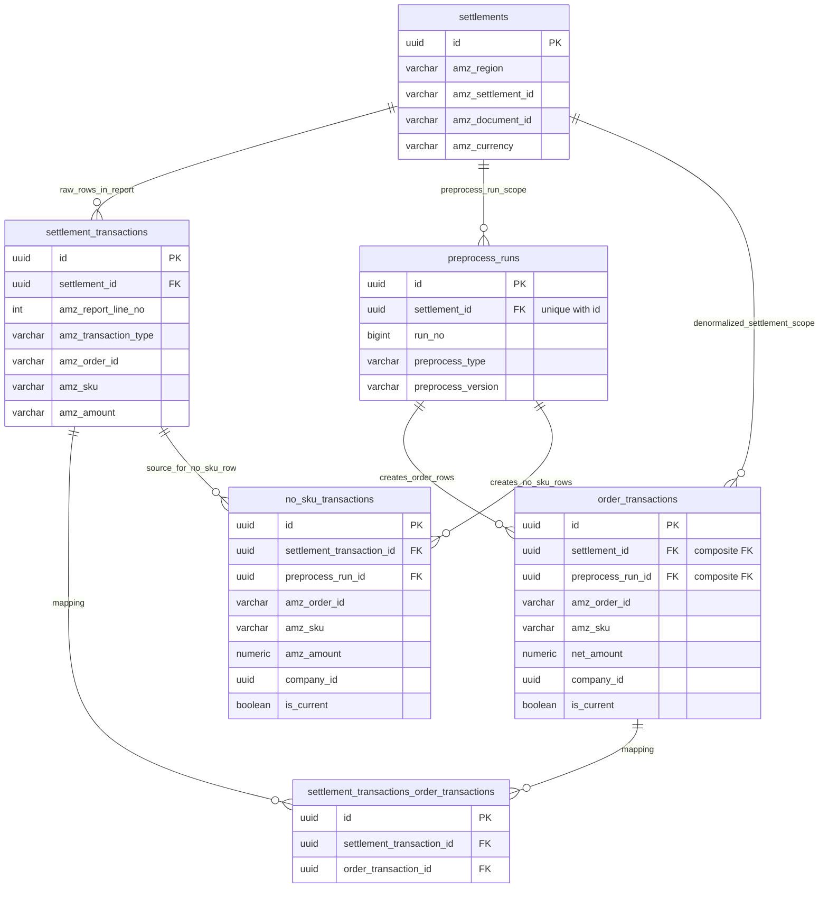

# A-SelBox

Amazon SP-API를 통해 물품 sku별 매출과 비용을 계산한다. Company A에 속한 user a가 로그인하면, A의 물품 sku별로 매출과 비용을 계산해 보여준다. 이 때, 계산된 비용은 Amazon의 fee 외에도 사전에 정해진 fee (company_fees)도 포함한 A가 정산 받을 때의 최종 비용이다.

기본적인 매출, 비용은 Settlement Report를 통해 계산한다. 이 때, Storage fee, Advertisement fee, DisposalComplete 비용은 Settlement Report에서 sku별로 분배되지 않고, 한 번에 청구된다.

일단 proof of concept를 위해 sku별 분배 구현을 생략하고 구현할 예정이다.

TODO:

- Storage fee / StorageRenewalBilling 은 Storage Fees Report를 통해
- Advertisement fee는 Amazon Ads API를 통해
- DisposalComplete 은 Removal Order Detail Report를 통해

sku별로 분배한다.

## Tables / Views / Functions

Amazon SP-API에서 가져온 데이터는 앞에 amz을 붙여 구분하였다.
전체적인 구조는 다음과 같다.

### Schemas

| Schema       | Purpose                                           |
| ------------ | ------------------------------------------------- |
| `public`     | Frontend가 접근할 public tables/views             |
| `private`    | Raw data, preprocessed data, admin/helper objects |
| `extensions` | PostgreSQL extensions                             |

### Extensions

| Object                  | Purpose                                                                   |
| ----------------------- | ------------------------------------------------------------------------- |
| `extensions.btree_gist` | `company_fees.valid_period` overlap 방지용 GiST exclusion constraint 지원 |

### Public tables

| Table                    | Purpose                                                     |
| ------------------------ | ----------------------------------------------------------- |
| `public.companies`       | Company 정보                                                |
| `public.company_fees`    | SKU / marketplace / 기간별 company fee 및 담당 company 매핑 |
| `public.users_companies` | Supabase auth user와 company의 1:1 소속 매핑                |

### Private raw tables

| Table                             | Purpose                                     |
| --------------------------------- | ------------------------------------------- |
| `private.settlements`             | Settlement Report metadata row 원본 저장    |
| `private.settlement_transactions` | Settlement Report transaction row 원본 저장 |

### Private preprocessed tables

| Table                         | Purpose                                                                                                  |
| ----------------------------- | -------------------------------------------------------------------------------------------------------- |
| `private.order_transactions`  | `amz_order_id`와 `amz_sku`가 있는 settlement transactions를 order+sku 단위로 집계한 current/history 결과 |
| `private.no_sku_transactions` | `amz_order_id` 또는 `amz_sku`가 없는 settlement transactions를 별도 처리한 current/history 결과          |

### Private mapping tables

| Table                                                | Purpose                                                                |
| ---------------------------------------------------- | ---------------------------------------------------------------------- |
| `private.settlement_transactions_order_transactions` | Raw settlement transaction과 preprocessed order transaction의 N:M 매핑 |

### Private metadata/admin tables

| Table                     | Purpose                                                               |
| ------------------------- | --------------------------------------------------------------------- |
| `private.admins`          | Admin user 목록                                                       |
| `private.preprocess_runs` | Preprocess 실행 이력, 대상 settlement, version, type, run number 저장 |

### Public views

| View                              | Purpose                                         |
| --------------------------------- | ----------------------------------------------- |
| `public.order_transactions_view`  | Frontend가 조회하는 current order transactions  |
| `public.no_sku_transactions_view` | Frontend가 조회하는 current no-sku transactions |

### Private helper functions

| Function                | Purpose                            |
| ----------------------- | ---------------------------------- |
| `private.is_admin()`    | 현재 로그인 유저가 admin인지 확인  |
| `private.get_company()` | 현재 로그인 유저의 company id 반환 |

### ER Diagram



### 1. private.settlements

GET_V2_SETTLEMENT_REPORT_DATA_FLAT_FILE_V2 데이터. Settlement Report에서, header 다음 metadata row에 있는 정보.
원본 보존용 테이블이므로 받아온 내용을 그대로 VARCHAR로 저장.
INSERT만 진행.

```sql
create table private.settlements (
    id uuid primary key default gen_random_uuid(),
    amz_region varchar(20) not null,
    amz_settlement_id varchar(255) not null,
    amz_document_id varchar(255) not null,
    amz_settlement_start_date varchar(255) not null,
    amz_settlement_end_date varchar(255) not null,
    amz_deposit_date varchar(255) not null,
    amz_total_amount varchar(255) not null,
    amz_currency varchar(3) not null,
    created_at timestamptz default current_timestamp not null,

    constraint uq_settlements_region_settlement_id
    unique (amz_region, amz_settlement_id),

    constraint uq_settlements_region_document_id
    unique (amz_region, amz_document_id)
);
```

### 2. private.settlement_transactions

GET_V2_SETTLEMENT_REPORT_DATA_FLAT_FILE_V2 데이터. Settlement Report에서, metadata row 이후 transaction row에 있는 정보.
원본 보존용 테이블이므로 받아온 내용을 그대로 VARCHAR로 저장.
INSERT만 진행.

```sql
create table private.settlement_transactions (
    id uuid primary key default gen_random_uuid(),
    settlement_id uuid not null references private.settlements (id),
    amz_report_line_no int not null,

    amz_transaction_type varchar(255) not null,
    amz_order_id varchar(255),
    amz_merchant_order_id varchar(255),
    amz_adjustment_id varchar(255),
    amz_shipment_id varchar(255),
    amz_marketplace_name varchar(255),
    amz_amount_type varchar(255) not null,
    amz_amount_description varchar(255) not null,
    amz_amount varchar(255) not null,
    amz_fulfillment_id varchar(255),
    amz_posted_date varchar(255) not null,
    amz_posted_date_time varchar(255) not null,
    amz_order_item_code varchar(255),
    amz_merchant_order_item_id varchar(255),
    amz_merchant_adjustment_item_id varchar(255),
    amz_sku varchar(255),
    amz_quantity_purchased varchar(255),
    amz_promotion_id varchar(255),
    created_at timestamptz default current_timestamp not null,

    -- Amazon Settlement Report의 line이 중복으로 INSERT되지 않도록 방지
    constraint uq_settlement_tx_settlement_report_line_no
    unique (settlement_id, amz_report_line_no)
);
```

### 3. public.companies

```sql
create table public.companies (
    id uuid primary key default gen_random_uuid(),
    company_name varchar(255) not null unique,
    created_at timestamptz default current_timestamp not null
);
```

### 4. public.company_fees

각 company가 어떤 amz_sku, amz_marketplace를 담당하고 있는지, 담당 물건에 적용된 fee_rate은 얼마인지 저장. fee_rate은 변할 수 있으므로 valid_period \[valid_from, valid_to)를 통해 기간을 저장.
amz_marketplace가 `__ALL__`인 경우, 모든 amz_marketplace에 대해 적용. 단, amz_marketplace가 `__ALL__`이 아닌 row가 있다면 이를 우선적으로 적용함.

```sql
create extension if not exists btree_gist with schema extensions;

create table public.company_fees (
    id uuid primary key default gen_random_uuid(),
    company_id uuid not null references public.companies (id),
    amz_sku varchar(255) not null,
    amz_marketplace_name varchar(255) default '__ALL__' not null,
    fee_rate numeric(12, 10) not null,
    valid_period tstzrange not null,
    created_at timestamptz default current_timestamp not null,

    constraint ck_company_fees_fee_rate_valid
    check (fee_rate >= 0 and fee_rate <= 1),

    constraint ck_company_fees_valid_period_not_empty
    check (not isempty(valid_period)),

    constraint ck_company_fees_valid_period_lower_upper
    check (lower_inc(valid_period) and not upper_inc(valid_period)),

    constraint ex_company_fees_valid_period_no_overlap
    exclude using gist (
        amz_sku with =,
        amz_marketplace_name with =,
        valid_period with &&
    )
);
```

fee lookup의 예시 code는 다음과 같다.

```sql
select cf.*
from public.company_fees cf
where
    cf.amz_sku = $1
    and cf.valid_period @> $2::timestamptz
    and cf.amz_marketplace_name in ($3, '__ALL__')
order by
    case when cf.amz_marketplace_name = $3 then 0 else 1 end
limit 1;
```

이때, python에서 $1, $2, $3에 들어갈 값은 각각 amz_sku, amz_posted_date_time, amz_marketplace_name이고, $3이 NULL이 아니도록 주의해야 한다.

INDEX

```sql
create index idx_company_fees_company_id
on public.company_fees (company_id);
```

### 5. public.users_companies

각 user가 어느 company 소속인지 저장. 각 user는 하나의 company에만 속함을 보장할 수 있다.
참고: Supabase를 사용하므로 auth.users 테이블이 이미 존재.

```sql
create table public.users_companies (
    user_id uuid primary key references auth.users (id) on delete cascade,
    company_id uuid not null references public.companies (id),
    created_at timestamptz default current_timestamp not null
);
```

INDEX

```sql
create index idx_users_companies_company_id
on public.users_companies (company_id);
```

private.get_company: login한 user의 소속 company를 반환하는 security definer function

```sql
create or replace function private.get_company()
returns uuid
language sql
security definer
stable
set search_path = ''
as $$
    select uc.company_id
    from public.users_companies uc
    where uc.user_id = auth.uid()
    limit 1;
$$;
```

### 6. private.admins

admins table은 service role key를 통해 직접 수정할 예정이다.
api를 통한 수정은 불가능하다.

```sql
create table private.admins (
    user_id uuid primary key references auth.users (id) on delete cascade,
    created_at timestamptz default current_timestamp not null
);
```

private.is_admin: login한 user가 admin인지를 반환하는 security definer function

```sql
create or replace function private.is_admin()
returns boolean
language sql
security definer
stable
set search_path = ''
as $$
    select exists (
        select 1
        from private.admins admins
        where admins.user_id = auth.uid()
    );
$$;
```

### 7. private.order_transactions

private.settlement_transactions의 row 중 amz_order_id와 amz_sku가 NOT NULL인 row들을 user가 보기 쉽도록 preprocess한 table.
private.settlement_transactions, public.company_fees 테이블을 통해 계산된다. frontend에서 NUMERIC 값이 NULL이면 빈 칸으로 표시하기 위해 NULL을 허용한다. company가 지정되지 않은 amz_sku가 있을 수 있으므로 company_id, company_fee_id에 NULL을 허용한다.

preprocess 과정에서 같은 settlement 내의 amz_order_id, amz_sku가 같으면 하나의 row로 합치기 때문에 (amz_order_id, amz_sku, preprocess_run_id)가 UNIQUE 하다. 이 제약은 is_current=true인 row에 대해서는 UNIQUE (settlement_id, amz_order_id, amz_sku)로 보장한다.

INSERT와 UPDATE만 진행한다.
UPDATE는 is_current를 true->false로 만드는 경우밖에 일어나지 않는다.

```sql
create table private.order_transactions (
    id uuid primary key default gen_random_uuid(),
    settlement_id uuid not null references private.settlements (id),
    preprocess_run_id uuid not null,
    amz_posted_date_time timestamptz not null,

    amz_sku varchar(255) not null,
    amz_order_id varchar(255) not null,
    amz_marketplace_name varchar(255),

    amz_order_item_price numeric(38, 6),
    amz_order_item_fees numeric(38, 6),
    amz_order_item_withheld_tax numeric(38, 6),
    amz_order_promotion numeric(38, 6),
    amz_refund numeric(38, 6),
    amz_others numeric(38, 6),

    selbox_fees numeric(38, 6),
    -- 매출과 비용을 따로 구분하지 않는다. 즉, 부호가 음수이면 비용이다.
    -- 따라서, net_amount는 단순히 합을 구하면 된다.
    net_amount numeric(38, 6) not null generated always as (
        coalesce(amz_order_item_price, 0)
        + coalesce(amz_order_item_fees, 0)
        + coalesce(amz_order_item_withheld_tax, 0)
        + coalesce(amz_order_promotion, 0)
        + coalesce(amz_refund, 0)
        + coalesce(amz_others, 0)
        + coalesce(selbox_fees, 0)
    ) stored,

    amz_quantity_purchased int4,
    amz_details jsonb default '{}'::jsonb not null,
    amz_currency varchar(3) not null,

    company_id uuid references public.companies (id),
    company_fee_id uuid references public.company_fees (id),

    created_at timestamptz default current_timestamp not null,

    is_current boolean not null default true,

    constraint uq_order_transactions_order_sku_run
    unique (amz_order_id, amz_sku, preprocess_run_id),

    constraint fk_order_transactions_run_settlement
    foreign key (preprocess_run_id, settlement_id)
    references private.preprocess_runs (id, settlement_id)
);
```

INDEX

```sql
create unique index uq_order_transactions_current_st_order_sku
on private.order_transactions (
    settlement_id,
    amz_order_id,
    amz_sku
)
where is_current;

create index idx_order_transactions_current_company_date_sku
on private.order_transactions (
    company_id,
    amz_posted_date_time desc,
    amz_sku
)
where is_current;

create index idx_order_transactions_preprocess_run_settlement
on private.order_transactions (preprocess_run_id, settlement_id);

create index idx_order_transactions_company_fee_id
on private.order_transactions (company_fee_id);
```

### 8. private.settlement_transactions_order_transactions

settlement_transactions \<-> order_transactions N:M 대응

preprocess 자체는 N개의 settlement_transaction들을 1개의 order_transaction으로 만든다. 따라서 한 order_transaction 기준으로는 N:1 대응이다. 하지만, preprocess run을 여러번 진행할 수 있기 때문에 table은 N:M 대응이다.

preprocess 방식에 의해 order_transaction_id가 같은 row들은 settlement_transaction_id에 대응되는 settlement_transaction의 settlement_id에 대응되는 settlement의 amz_settlement_id가 동일하다. (preprocess 과정에서 합쳐지는 N개의 settlement_transaction들은 모두 동일한 amz_settlement에 속한다)
preprocess 방식에 의해 order_transaction_id에 대응되는 order_transaction의 preprocess_run_id가 같은 row들은 settlement_transaction_id가 중복되지 않는다. (preprocess는 settlement 단위로 진행된다. 즉, 1번의 preprocess run은 1개의 settlement report에 대해서 진행된다.)

```sql
create table private.settlement_transactions_order_transactions (
    id uuid primary key default gen_random_uuid(),
    settlement_transaction_id uuid not null references private.settlement_transactions (id),
    order_transaction_id uuid not null references private.order_transactions (id),
    created_at timestamptz default current_timestamp not null,

    constraint uq_settlement_transaction_order_transaction_pair
    unique (settlement_transaction_id, order_transaction_id)
);
```

INDEX

```sql
create index idx_settlement_tx_order_tx_id
on private.settlement_transactions_order_transactions (order_transaction_id);
```

### 9. public.order_transactions_view

User가 Order transaction을 조회하기 위한 view이다.
private.order_transactions에서 is_current=true인 current row만 선택한 view이다.

```sql
create view public.order_transactions_view
with (security_invoker = true)
as
select
    ot.id,
    ot.amz_posted_date_time,
    ot.amz_sku,
    ot.amz_order_id,
    ot.amz_marketplace_name,
    ot.amz_order_item_price,
    ot.amz_order_item_fees,
    ot.amz_order_item_withheld_tax,
    ot.amz_order_promotion,
    ot.amz_refund,
    ot.amz_others,
    ot.selbox_fees,
    ot.net_amount,
    ot.amz_quantity_purchased,
    ot.amz_details,
    ot.amz_currency,
    ot.created_at
from private.order_transactions as ot
where ot.is_current;
```

### 10. private.no_sku_transactions

private.settlement_transactions의 row 중 amz_order_id 또는 amz_sku가 NULL인 row들을 user가 보기 쉽도록 preprocess한 table.

preprocess 과정에서 settlement_transaction row가 하나의 no_sku_transaction row로 복사되기 때문에 (settlement_transaction_id, preprocess_run_id)가 UNIQUE 하다. 이 제약은 is_current=true인 row에 대해서는 UNIQUE (settlement_transaction_id)로 보장한다.

INSERT와 UPDATE만 진행한다.
UPDATE는 is_current를 true->false로 만드는 경우밖에 일어나지 않는다.

```sql
create table private.no_sku_transactions (
    id uuid primary key default gen_random_uuid(),
    settlement_transaction_id uuid not null references private.settlement_transactions (id),
    amz_posted_date_time timestamptz not null,

    amz_sku varchar(255) default '__UNKNOWN__' not null,
    amz_order_id varchar(255),
    amz_marketplace_name varchar(255),

    amz_transaction_type varchar(255) not null,
    amz_amount_type varchar(255) not null,
    amz_amount_description varchar(255) not null,
    amz_amount numeric(38, 6) not null,
    amz_currency varchar(3) not null,

    company_id uuid references public.companies (id),

    preprocess_run_id uuid not null references private.preprocess_runs (id),
    created_at timestamptz default current_timestamp not null,

    is_current boolean not null default true,

    constraint uq_no_sku_transactions_settlement_tx_run
    unique (settlement_transaction_id, preprocess_run_id)
);
```

INDEX

```sql
create unique index uq_no_sku_transactions_current_st_tx
on private.no_sku_transactions (settlement_transaction_id)
where is_current;

create index idx_no_sku_transactions_current_company_date_sku
on private.no_sku_transactions (
    company_id,
    amz_posted_date_time desc,
    amz_sku
)
where is_current;

create index idx_no_sku_transactions_preprocess_run_id
on private.no_sku_transactions (preprocess_run_id);
```

### 11. public.no_sku_transactions_view

User가 no sku transaction을 조회하기 위한 view이다.
private.no_sku_transactions에서 is_current=true인 current row만 선택한 view이다.

```sql
create view public.no_sku_transactions_view
with (security_invoker = true)
as
select
    nst.id,
    nst.amz_posted_date_time,
    nst.amz_sku,
    nst.amz_order_id,
    nst.amz_marketplace_name,
    nst.amz_transaction_type,
    nst.amz_amount_type,
    nst.amz_amount_description,
    nst.amz_amount,
    nst.amz_currency,
    nst.created_at
from private.no_sku_transactions as nst
where nst.is_current;
```

### 12. private.preprocess_runs

```sql
create table private.preprocess_runs (
    id uuid primary key default gen_random_uuid(),
    settlement_id uuid not null references private.settlements (id),

    run_no bigint generated always as identity unique,
    preprocess_version varchar(255) not null,
    -- order, no_sku 중 하나의 값이다.
    -- 어떤 방식의 preprocess를 적용했는지 나타낸다.
    preprocess_type varchar(50) not null,
    preprocess_description text default '' not null,
    created_at timestamptz default current_timestamp not null,

    constraint uq_preprocess_runs_id_settlement
    unique (id, settlement_id),

    constraint preprocess_runs_preprocess_type_valid
    check (preprocess_type in ('order', 'no_sku'))
);
```

INDEX

```sql
create index preprocess_runs_preprocess_type_run_no_idx
on private.preprocess_runs (preprocess_type, run_no desc);

create index idx_preprocess_runs_settlement_id
on private.preprocess_runs (settlement_id);
```

### Permissions / RLS / Security Policies 정리

Rules:

- anon: no access
- authenticated: can query public views
- admin authenticated:
  - can SELECT companies
  - can SELECT company_fees
  - can manage users_companies
- company user: can SELECT only their own order/no_sku transaction rows
- backend/service role/direct DB: sync/preprocess/manage tables (e.g., private.admins, ...)

```sql
revoke all on schema public, private from public;
revoke all on schema public, private from anon;
revoke all on schema public, private from authenticated;

revoke all on all tables in schema public, private from public;
revoke all on all tables in schema public, private from anon;
revoke all on all tables in schema public, private from authenticated;

revoke all on all functions in schema public, private from public;
revoke all on all functions in schema public, private from anon;
revoke all on all functions in schema public, private from authenticated;

revoke all on all sequences in schema public, private from public;
revoke all on all sequences in schema public, private from anon;
revoke all on all sequences in schema public, private from authenticated;

alter default privileges in schema public revoke all on tables from public;
alter default privileges in schema public revoke all on tables from anon;
alter default privileges in schema public revoke all on functions from public;
alter default privileges in schema public revoke all on functions from anon;
alter default privileges in schema public revoke all on sequences from public;
alter default privileges in schema public revoke all on sequences from anon;

alter default privileges in schema private revoke all on tables from public;
alter default privileges in schema private revoke all on tables from anon;
alter default privileges in schema private revoke all on functions from public;
alter default privileges in schema private revoke all on functions from anon;
alter default privileges in schema private revoke all on sequences from public;
alter default privileges in schema private revoke all on sequences from anon;

grant usage on schema public to authenticated;

grant execute on function private.is_admin() to authenticated;
grant execute on function private.get_company() to authenticated;

grant select
on public.companies,
public.company_fees
to authenticated;

grant select, insert, update, delete
on public.users_companies
to authenticated;

-- security_invoker view 조회에는 underlying private table의 SELECT 권한이 필요하다.
-- 단, view 사용자에게 private schema의 USAGE 권한은 필요하지 않다.
grant select
on private.order_transactions,
private.no_sku_transactions
to authenticated;

grant select
on public.order_transactions_view,
public.no_sku_transactions_view
to authenticated;

alter table public.companies enable row level security;
alter table public.company_fees enable row level security;
alter table public.users_companies enable row level security;

alter table private.settlements enable row level security;
alter table private.settlement_transactions enable row level security;
alter table private.admins enable row level security;
alter table private.preprocess_runs enable row level security;
alter table private.order_transactions enable row level security;
alter table private.settlement_transactions_order_transactions enable row level security;
alter table private.no_sku_transactions enable row level security;

create policy admins_can_select_companies
on public.companies
for select
to authenticated
using ((select private.is_admin()));

create policy admins_can_select_company_fees
on public.company_fees
for select
to authenticated
using ((select private.is_admin()));

create policy admins_can_manage_users_companies
on public.users_companies
for all
to authenticated
using ((select private.is_admin()))
with check ((select private.is_admin()));

create policy admins_and_company_users_can_select_order_transactions
on private.order_transactions
for select
to authenticated
using (
    (select private.is_admin())
    or company_id = (select private.get_company())
);

create policy admins_and_company_users_can_select_no_sku_transactions
on private.no_sku_transactions
for select
to authenticated
using (
    (select private.is_admin())
    or company_id = (select private.get_company())
);
```

## Syncing the Database through SP-API

### A. Downloading the Settlement Report and Inserting into the Database

endpoint, `days`를 input으로 받는다.

```sh
cd services/sync
conda run -n A-SelBox python run_download.py --amz-endpoint NA --days 14
```

1. SP-API를 이용해 주어진 endpoint에서 최근 `days`동안 만들어진 settlement reports의 report document id를 받음
1. SP-API를 이용해 report document id들에 해당하는 settlement report 파일들을 다운로드
1. 다운로드 한 settlement report들을 parse 후, private.settlements, private.settlement_transactions에 INSERT
   settlement report의 첫째 줄은 column name, 둘째 줄은 settlement report의 metadata, 셋째 줄 부터 transaction row이다.
   둘째 줄은 private.settlements에 INSERT, 셋째 줄부터는 private.settlement_transactions에 INSERT 한다.
1. INSERT한 settlement report들의 settlement_id list를 return

- 같은 settlement report를 여러 번 다운로드해도 중복 insert되지 않아야 한다.
- `settlements`: `(amz_region, amz_settlement_id)`, `(amz_region, amz_document_id)` 기준으로 중복 방지
- `settlement_transactions`: `(settlement_id, amz_report_line_no)` 기준으로 중복 방지
- private.settlements에 INSERT할 때 ON CONFLICT DO NOTHING으로 중복 방지. settlement가 중복이면 private.settlement_transactions는 INSERT를 실행하지도 않는다. 따라서 settlement_transactions INSERT에서 중복이 발생하면 exception을 raise한다.

### B. Preprocessing Settlement Transactions (Order Transactions)

settlement_id를 input으로 받는다.

```sh
cd services/sync
conda run -n A-SelBox python run_preprocess_order_transactions.py \
  --settlement-id <settlement_id>
```

1. private.settlement_transactions에서 settlement_id에 해당하는 transaction rows 선택
1. amz_order_id, amz_sku가 NOT NULL인 row 선택
1. 선택된 row들을 amz_order_id, amz_sku로 GROUP BY 해서 GROUP내에서 하나로 합침
1. amz_sku, amz_marketplace_name으로 public.company_fees 테이블을 조회해 company_id, company_fee_id, selbox_fees 계산
1. private.preprocess_runs에 이번 preprocess run INSERT
1. private.order_transactions row 중, 현재 settlement_id row들의 is_current를 false로 UPDATE
1. preprocess된 row들을 private.order_transactions에 INSERT
1. 해당하는 mapping을 private.settlement_transactions_order_transactions에 INSERT

- 5, 6, 7, 8의 table INSERT/UPDATE 과정은 하나의 transaction으로 진행한다.
- Preprocess는 settlement 단위로 진행한다. 환불 등이 발생할 경우, 같은 order가 다른 settlement에 존재할 수 있다. 이러한 경우, 각기 다른 row로 만들어진다.
- SP-API의 Orders API에서 getOrder는 input parameter로 order-id만 받고, marketplace-name은 받지 않는다. 즉, 아마존 SP-API에서는 order-id 단독으로 주문을 식별할 수 있다. 따라서 GROUP BY 할 때 amz_marketplace_name을 고려하지 않아도 문제가 없다.
- frontend에서 NUMERIC 값이 NULL이면 빈 칸으로 표시하기 위해 NUMERIC 값에 NULL을 허용한다.
- company가 지정되지 않은 amz_sku가 있을 수 있으므로 company_id, company_fee_id에 NULL을 허용한다.

### C. Preprocessing the Settlement Transactions (No SKU Transactions)

settlement_id를 input으로 받는다.

```sh
cd services/sync
conda run -n A-SelBox python run_preprocess_no_sku_transactions.py \
  --settlement-id <settlement_id>
```

1. private.settlement_transactions에서 settlement_id에 해당하는 transaction rows 선택
1. amz_order_id 또는 amz_sku가 NULL인 row 선택
   - amz_sku가 NULL인 경우, amz_sku에 `__UNKNOWN__`이라는 placeholder 값을 넣는다.
   - amz_sku가 NULL이 아닌 경우, amz_sku, amz_marketplace_name으로 public.company_fees 테이블을 조회해 company_id를 계산한다.
1. private.preprocess_runs에 이번 preprocess run INSERT
1. private.no_sku_transactions row 중, 해당 settlement_id에 속한 current row들의 is_current를 false로 UPDATE
1. 선택된 row들을 private.no_sku_transactions에 INSERT

- 3, 4, 5의 table INSERT/UPDATE 과정은 하나의 transaction으로 진행한다.

### Overall Procedure

1. A에서 settlement reports 다운로드
1. A에서 return한 settlement_id list에 대해서 B 반복
1. A에서 return한 settlement_id list에 대해서 C 반복

## Formatting

Activate the project Conda environment before running the commands below:

```sh
conda activate A-SelBox
```

### PostgreSQL

sqlfluff

```sh
sqlfluff fix .
sqlfluff lint .
```

### Markdown

mdformat + mdformat-gfm + pymarkdownlnt

The PyPI package that provides the `pymarkdown` command is `pymarkdownlnt`.

```sh
mdformat .
pymarkdown scan -r .
```

### Python

ruff

```sh
ruff check --fix . && ruff format .
pyright --pythonpath "$(command -v python)"
```
