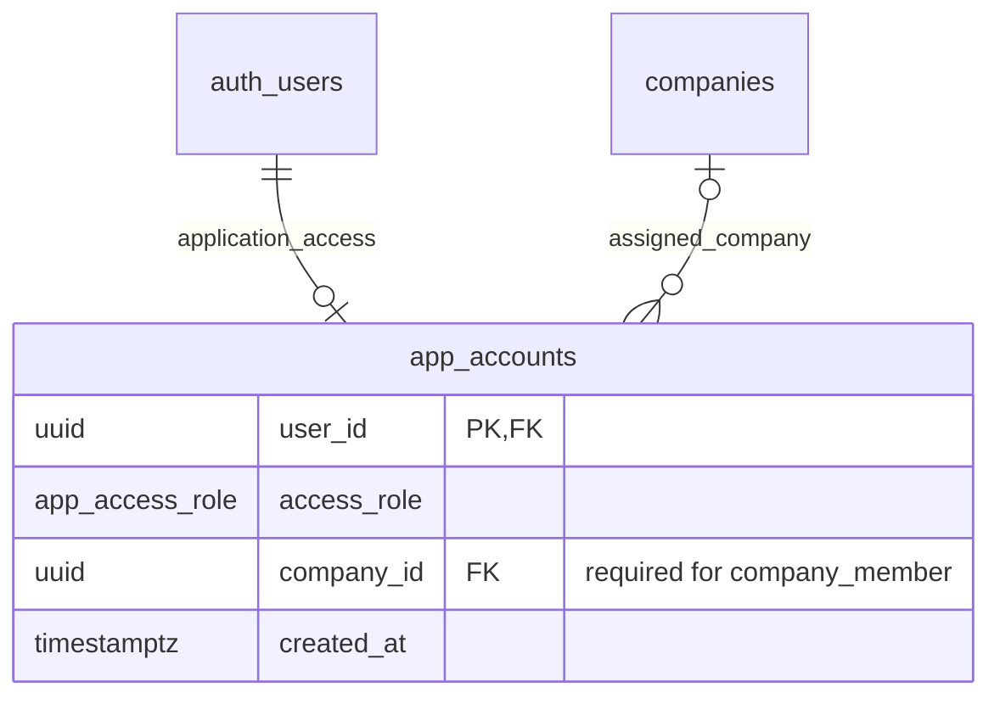

# Application access

The application distinguishes two roles: **operator** (SelBox admin) and
**company_member** (SelBox user). Both sign in through Supabase Auth and use
REST with their own access token. A **DB administrator** connects directly to
PostgreSQL and is not represented by an application role or Auth account.

## Account model



`public.app_accounts.user_id` references `auth.users.id`. There is at most one
application account per Auth user. An operator has no company assignment; a
company member must have exactly one existing company. The default role for a
new application account is `company_member`.

Supabase Auth owns login identities. Operators add and remove application
access for existing Auth accounts; they do not create or delete Auth identities.
Deleting an Auth identity cascades to its application-access row. An Auth user
without an application account has no application-data access.

Only the DB administrator can provision, promote, change, or remove operators.
For an existing Auth user, bootstrap an operator through trusted SQL:

```sql
insert into public.app_accounts (user_id, access_role, company_id)
values ('EXISTING_AUTH_USER_UUID', 'operator', null);
```

Replace the placeholder with the existing UUID. Python administration uses the
PostgreSQL connection credentials through `DatabaseConnection`. The Storage
service-role API key is a separate capability and is not a PostgreSQL login.

## Permission matrix

| Capability                                              | DB administrator        | Operator                             | Company member                                  |
| ------------------------------------------------------- | ----------------------- | ------------------------------------ | ----------------------------------------------- |
| Read application accounts                               | All                     | All operators and members            | Own account only                                |
| Read companies                                          | All                     | All                                  | Own assigned company                            |
| Add/remove application members or change their company  | Yes                     | Yes                                  | No                                              |
| Manage operator accounts                                | Yes                     | No                                   | No                                              |
| Read company assignments and fee periods                | All versions            | All versions                         | Current terms for own company's SKUs            |
| Publish a complete seller/SKU terms version             | Python/SQL              | REST RPC                             | No                                              |
| Read source preprocessing facts                         | All retained versions   | All retained versions and categories | Current versions of permitted own-company facts |
| Read full preprocessing headers and diagnostics         | Yes                     | Yes                                  | No                                              |
| Read payout reports, components, and input references   | All                     | All                                  | No                                              |
| Publish acquisitions, source results, or payout reports | Python/SQL              | No                                   | No                                              |
| Run Data Kiosk pruning                                  | Python/SQL              | No                                   | No                                              |
| Read raw document archives                              | Trusted archive service | No                                   | No                                              |

Company members see Settlement `SETTLEMENT` facts and owned Data Kiosk facts
except `SELBOX`. Category rules keep account/control amounts
outside company access. Both the source version and SKU assignment must be
current. Historical activity dates inside a current result remain visible;
"current" refers to the selected version, not a recent-date window.

Operators can read every retained historical result. A pruned Data Kiosk version
keeps its header and pruning marker, but its removed component payload is
unavailable. Payout report references protect required versions, including empty
days, from pruning.

## REST interfaces

The examples below show request paths and JSON bodies. Authenticate with the
caller's normal Supabase access token; never give an operator a service-role key.

`GET /rest/v1/app_accounts?select=*` lists all accounts for an operator and only
the caller's row for a company member. The member can also read its company from
`/rest/v1/companies`.

An operator grants application access to an existing Auth user:

```text
POST /rest/v1/app_accounts
{"user_id":"AUTH_USER_UUID","company_id":"COMPANY_UUID"}
```

Change that member's company:

```text
PATCH /rest/v1/app_accounts?user_id=eq.AUTH_USER_UUID
{"company_id":"NEW_COMPANY_UUID"}
```

Remove application access:

```text
DELETE /rest/v1/app_accounts?user_id=eq.AUTH_USER_UUID
```

These writes can target company members only. REST cannot supply or change
`access_role`, modify `user_id`, or edit an operator account. Removing an
application account leaves the Auth login intact; subsequent requests using
even a previously issued token lose application access. Company changes also
take effect on subsequent requests without requiring a new token.

Operators publish complete terms through `POST /rest/v1/rpc/publish_sku_terms`:

```json
{
  "p_seller_namespace": "seller-na",
  "p_sku": "SKU-001",
  "p_company_id": "COMPANY_UUID",
  "p_expected_current_version_id": null,
  "p_change_reason": "Initial complete terms",
  "p_periods": [
    {
      "marketplace_name": "Amazon.com",
      "valid_from": "2026-01-01",
      "valid_to": null,
      "fee_rate_percent": "5"
    }
  ]
}
```

Use the selected terms UUID instead of NULL for a replacement. The server
generates UUIDv7 identifiers and uses the atomic full-inventory
publisher; stale replacements fail. The submission replaces all marketplaces
for that seller/SKU. A NULL company unassigns the SKU, and an empty fee inventory
withdraws fee coverage; payout publication rejects unresolved required inputs.

| Read endpoint under `/rest/v1/`                                                                          | Operator                                         | Company member                     |
| -------------------------------------------------------------------------------------------------------- | ------------------------------------------------ | ---------------------------------- |
| `seller_skus`, `sku_terms_versions`, `sku_fee_periods`                                                   | All identities and revisions                     | Own company's selected terms       |
| `company_skus`, `current_sku_fee_periods`                                                                | Current projections across companies             | Own company current projections    |
| `settlement_preprocess_entries`, `data_kiosk_preprocess_entries`                                         | All retained source rows                         | Permitted current own-company rows |
| `settlement_preprocess_results`, `data_kiosk_preprocess_results`                                         | Full historical result metadata                  | Denied                             |
| Company category views and `live_company_components`                                                     | Current data permitted by each view's definition | Current own-company data           |
| `company_payout_reports`, `company_payout_report_components`                                             | All saved reports and components                 | No rows                            |
| `payout_report_settlement_versions`, `payout_report_data_kiosk_versions`, `payout_report_terms_versions` | All saved input references                       | No rows                            |

## How RLS enforces this

Role and company checks read `app_accounts` using the authenticated caller's
`auth.uid()`. User-editable JWT metadata cannot grant permissions. Private
`SECURITY DEFINER` helpers perform only the caller-bound checks and explicitly
guarded privileged reads or terms publication. Their search paths are fixed.
REST views and the public RPC wrapper use invoker security.

Explicit column grants restrict account writes, while separate INSERT, UPDATE,
and DELETE policies restrict the actor and target role. UPDATE checks both the
existing row and its resulting company-member state. Source-row RLS enforces
current-version and current-company access even beneath the public views.

Member grants on source headers remain limited to the identifiers needed by
current views. Operator-only metadata functions provide full headers without
granting those account-wide controls to company members. Payout RLS requires an
operator, so full saved report columns and manifests are operator-only.

The private schema remains outside the REST API's exposed schemas. Source and
payout publication, pruning, acquisition manifests, and raw Storage objects are
not exposed through an operator endpoint. Authorization follows the database
snapshot of each request; changing access does not cancel a request already
running with an earlier snapshot.

Supabase checks [grants and RLS together](https://supabase.com/docs/guides/database/postgres/row-level-security);
Auth identities and [application profile data](https://supabase.com/docs/guides/auth/managing-user-data)
have separate lifecycles. Local tests exercise these rules with actual
Auth-issued operator/member tokens and PostgREST, as well as direct role-switched
PostgreSQL checks. See the [database verification guide](../services/db/supabase/README.md#verification).
