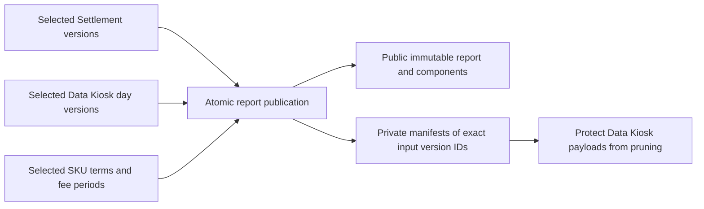

# Frozen company payout reports

Payout report publication saves exact company amounts and the source and fee
versions used to calculate them. Later imports, fee corrections, reassignment,
and unassignment change live reads but cannot change an existing report.
Publication records an entitlement calculation; approval and payment execution
are not implemented.

## Publish and read

Use the trusted Python repository with an open `DatabaseConnection`. The caller
declares the complete required source scope and supplies no calculated amounts:

```python
from datetime import date

from services.sync.src.database.payout_reports import (
    load_company_payout_report,
    load_company_payout_report_components,
    publish_company_payout_report,
)
from services.sync.src.preprocess_version import PREPROCESS_VERSION

report_id = publish_company_payout_report(
    database,
    company_id=company_id,
    seller_namespace="seller-na",
    currency="USD",
    start_date=date(2026, 6, 1),
    end_date=date(2026, 6, 30),
    preprocess_version=PREPROCESS_VERSION,
    settlement_ids=required_settlement_ids,
    marketplace_names=["Amazon.com"],
    dataset_key="economics",
    report_name="June company entitlement",
    change_reason="Publish the reviewed June source scope",
)
report = load_company_payout_report(database, report_id)
components = load_company_payout_report_components(database, report_id)
```

`company_id` and `required_settlement_ids` are existing local UUIDs; the latter
identifies canonical settlements, not Amazon's text settlement identifiers.
Dates are inclusive. `settlement_ids=[]` explicitly declares no required
Settlement inputs. An empty marketplace list declares no required Data Kiosk
coverage; otherwise every listed marketplace needs every day in the interval.
The caller is responsible for declaring the required business scope.

The Python publisher generates a report UUID and calls
`private.publish_company_payout_report(jsonb)` in one transaction. There is no
automatic publication retry or caller-selected historical-version parameter.
The loaders return saved values, preserving SQL numerics as `Decimal`; they do
not recalculate from today's selections.

The saved `calculation_version` is currently `v0`. It identifies the company-fee
formula separately from `preprocess_version`, which identifies source interpretation.

## Stored records and input manifests



| Relation                                    | One row represents                                                                                                                                                  |
| ------------------------------------------- | ------------------------------------------------------------------------------------------------------------------------------------------------------------------- |
| `public.company_payout_reports`             | One company, currency, declared source scope, calculation version, inventory counts, and exact totals.                                                              |
| `public.company_payout_report_components`   | One authoritative source row belonging to that saved company/currency, including its source references, selected terms/period, base, rate, fee, and company amount. |
| `private.payout_report_settlement_versions` | One report's exact version for a required canonical settlement; key `(report_id, settlement_id)`.                                                                   |
| `private.payout_report_data_kiosk_versions` | One report's exact version for a required day; key `(report_id, day_id)`.                                                                                           |
| `private.payout_report_terms_versions`      | One report's exact terms version for a seller/SKU used by authoritative facts in the declared date/source scope; key `(report_id, seller_sku_id)`.                  |

Composite foreign keys tie each manifest version to its actual identity. The
terms manifest includes authoritative scoped SKUs assigned to other companies
or currencies: their selected ownership explains why their rows were excluded
from this report. Public components contain only the requested company/currency.

Data Kiosk manifests include complete empty days, even if the report has zero
components. A current empty version is verified coverage; a missing or pruned
version is not. Multiple reports may retain the same version. Retention protects
the whole referenced day version, including rows excluded from a particular
company's components. There is no generic pin/unpin table or API.

## Publication guarantees

Publication locks required Data Kiosk day identities in natural order, then
required Settlement identities, before capturing current source selections and
selected SKU terms. It requires `READ COMMITTED` so source publication and
retention checks see work that committed before an awaited lock was acquired.
Missing, pruned, or incompatible required coverage fails the transaction.

The shared `private.resolve_company_components(...)` function calculates from
explicit version UUIDs. The report publisher rejects unresolved authoritative
ownership or fee inputs across the declared scope before filtering to one
company and currency. An unassigned SKU or missing applicable fee period cannot
silently become a zero or disappear from the report. Explicit 0% coverage is
valid; noncommission costs require ownership and no fee period.

The database checks complete manifest and component counts, exact saved rows,
provenance, and totals against the frozen inputs at commit. Report headers,
components, and manifests cannot be updated, deleted, truncated, or extended
after publication. Data Kiosk pruning keeps at least the latest three independent
observations, every current version, and every payout-referenced version. A
pruned historical payload cannot be attached to a report; reprocessing creates
a new version rather than restoring the old version ID.

## Access and remaining policy

Operators can read every report, component, and exact input reference through
REST. Company members have no payout access, including reports for their own
company. The saved `company_id` records the calculation's recipient; later SKU
or account reassignment does not change the report. Publication remains a
direct-database operation through the trusted Python repository or SQL.

Operator REST reads may use `select=*`, including complete-scope inventory
counts. Public invoker-security views expose the three private manifest tables
under the same base names. The report and manifest row policies require the
database-backed operator role. See the [application-access contract](access_control.md).

The calculation uses exact signed amounts without currency rounding or a zero
floor. The [refund commission over-credit issue](known_issues.md#deferred-refund-commission-over-credit-risk)
is deliberately deferred: a refund still uses its own posting-date rate, which
can refund more commission than the original sale charged. Saving a report
preserves that formula; it does not resolve the policy. Approval,
payment execution, cutoff policy, adjustments, negative-balance handling, and
currency rounding remain separate work.

Sources: [payout migration](../services/db/supabase/migrations/20260927080054_company_payout_reports.sql),
[Python repository](../services/sync/src/database/payout_reports.py),
[retention guards](../services/db/supabase/migrations/20260927080056_source_retention.sql),
and [live fee contract](company_fees.md).
