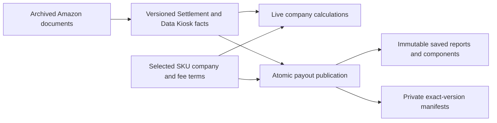
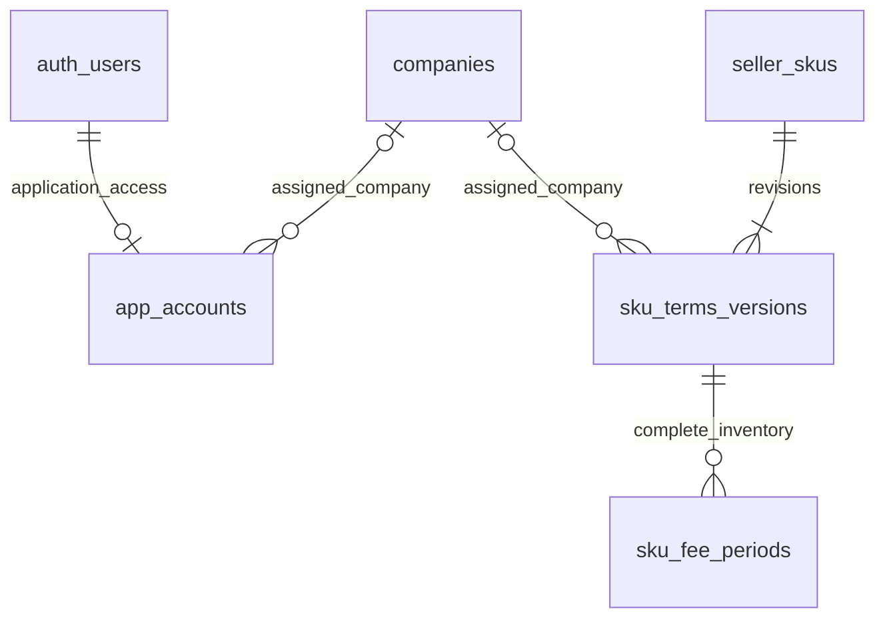
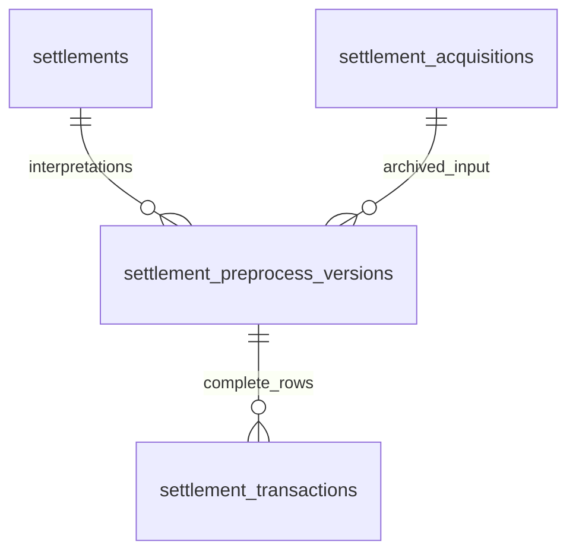
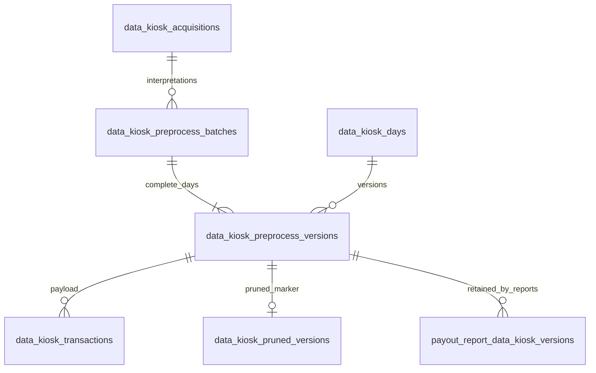

# Database schema

A-SelBox separates **archived Amazon evidence**, **complete versions of source facts**,
**company calculations made at query time**, and **frozen payout reports**.
Company assignment and fee periods are selected together in a SKU terms version.
Changing terms updates live results without rewriting source facts or saved reports.

The PostgreSQL 17/Supabase schema contains **20 application tables: 7 in `public`,
13 in `private`**. Supabase also supplies Auth and Storage tables. The five
fresh-install migration modules define source/terms records, atomic publication
and retention, live reads, frozen payouts, and application access. They do not
provide an upgrade or backfill path for an existing deployment.



Strict live totals use the privileged function
`private.company_financial_totals(...)`. The `public.live_company_components`
view also contains diagnostic rows, so a plain sum of that view is not a complete
financial total.

## Ownership and fee terms



These application tables belong to `public`; `auth_users` represents Supabase's
`auth.users`. A terms version may have no company, which is explicit unassignment.
`seller_skus.current_terms_version_id` selects one of its own revisions. The
publisher creates a required first selection atomically with a new identity.

| Table                | What one row represents                                 | Main key or relationship                                                                      |
| -------------------- | ------------------------------------------------------- | --------------------------------------------------------------------------------------------- |
| `companies`          | A company                                               | UUIDv7 `id`; required name                                                                    |
| `app_accounts`       | One Auth user's application role and company assignment | PK `user_id` → `auth.users`; `operator` has no company, `company_member` requires one company |
| `seller_skus`        | Stable identity for one seller's exact SKU              | Unique `(seller_namespace, sku)`; selected `current_terms_version_id`                         |
| `sku_terms_versions` | One complete company and all-marketplace fee revision   | Unique `(seller_sku_id, version_number)`; nullable company FK; `fee_period_count` and reason  |
| `sku_fee_periods`    | One marketplace/date interval and percentage            | FK `terms_version_id`; nonoverlapping periods within one version and marketplace              |

Selected ownership is **seller + exact SKU → company or unassigned**, across
marketplaces and all dates in live reads.
Application roles and user-company assignments are separate from SKU ownership;
see the [access model](access_control.md).
There is no separate seller or product master table. SKU strings are not foreign
keys to a product catalog. Source facts join to ownership by
`(seller_namespace, sku)`; they do not store `company_id`. This allows source
evidence to exist before an owner is assigned. Source imports do not register
company configuration. Publishing new terms may assign, reassign, or unassign;
identity and immutable revisions remain. There is no persisted Default company
or global fee-configuration version.

Fee periods use `[start, end)`: the start is included and the end is excluded.
The end may be unbounded. Rates are exact percentages from 0 through 100, with at
most six fractional digits. A complete version means the complete submitted
inventory, not guaranteed gap-free date coverage. A gap or an empty replacement
withdraws coverage; old versions do not fill the gap. An explicit 0% rate is valid
coverage.

`company_skus` is a view of selected assigned identities, not an ownership table.
`current_sku_fee_periods` contains periods from each assigned SKU's **selected terms
version**, including historical date ranges. The source row's activity date
selects the applicable period; it does not use today's date.

Source: [ownership and fee DDL](../services/db/supabase/migrations/20260912072531_live_source_versions.sql),
[ownership and fee contract](company_fees.md).

## Settlement source tables



All four source tables belong to `private`.

| Table                            | What one row represents                      | Main key or relationship                                                                                                        |
| -------------------------------- | -------------------------------------------- | ------------------------------------------------------------------------------------------------------------------------------- |
| `settlement_acquisitions`        | One successfully archived report acquisition | UUIDv7 PK; Amazon report/document IDs, API provenance, digest, and one JSONB `document` manifest                                |
| `settlements`                    | One canonical financial settlement           | Unique `(seller_namespace, amazon_scope, settlement_id)`; decoded-document digest; current version pointer                      |
| `settlement_preprocess_versions` | One complete interpretation of a settlement  | FKs to canonical settlement and acquisition; processor label, row count, report dates, currency, control total, diagnostics     |
| `settlement_transactions`        | One monetary source line in a version        | Unique `(version_id, source_line_number)`; category, seller/SKU, amount/currency, posting date/time, original labels and fields |

The two uses of `settlement_id` differ: `settlements.settlement_id` is the **Amazon
TSV text identifier**; `settlement_preprocess_versions.settlement_id` is the
**local UUID foreign key**.

Multiple API report aliases can resolve to the same canonical settlement if the
seller, Amazon scope, TSV settlement ID, and decoded bytes agree. Conflicting
decoded content is rejected. Acquisitions have no natural unique constraint;
their relationship to a canonical settlement runs through preprocessing versions.

A settlement transaction is a monetary line, not a whole order. One order can
contribute principal, tax, shipping, promotions, and fee lines. Publication checks
the complete row inventory, one currency, and the exact signed sum against the
version's report control total.

Source: [Settlement DDL](../services/db/supabase/migrations/20260912072531_live_source_versions.sql),
[publication functions](../services/db/supabase/migrations/20260912072703_atomic_publications.sql).

## Data Kiosk source tables



The six Data Kiosk source tables and the payout dependency table belong to `private`.

| Table                            | What one row represents                                      | Main key or relationship                                                                                                                       |
| -------------------------------- | ------------------------------------------------------------ | ---------------------------------------------------------------------------------------------------------------------------------------------- |
| `data_kiosk_acquisitions`        | One successful independent root-query observation            | Unique `(seller_namespace, amazon_scope, root_query_id)`; query time, requested coverage, complete ordered JSONB page inventory                |
| `data_kiosk_preprocess_batches`  | One complete publication from an acquisition                 | FK `acquisition_id`; positive `day_count`; contains all queried days                                                                           |
| `data_kiosk_days`                | One logical daily coverage slot                              | Unique `(seller_namespace, marketplace_name, activity_date, dataset_key)`; current version pointer                                             |
| `data_kiosk_preprocess_versions` | One complete day result within a batch                       | FKs to day and batch; unique `(batch_id, day_id)`; processor label, row count, normalized-content digest                                       |
| `data_kiosk_transactions`        | One normalized monetary component in a day version           | Unique `(version_id, component_key)`; seller/SKU, date/marketplace, category/type, amount/currency, quantity, fee base, dimensions, provenance |
| `data_kiosk_pruned_versions`     | A permanent record that a version's fact payload was removed | `version_id` is PK and FK; timestamp                                                                                                           |

The key distinction is **observation versus interpretation**. Downloading a new
root query creates a new observation. Reprocessing an existing acquisition creates
a new batch and day versions, but not another independent observation.

Data Kiosk selects freshness using `(root_query_created_at, acquisition_id)`.
Reprocessing an older query cannot displace a newer observation. Reprocessing the
same observation can advance its selected result using the local version UUID.
Audit timestamps such as `created_at` do not select financial results.

The current publisher accepts the `economics` dataset and requires one marketplace
per acquisition and every queried day in the batch. `amazon_scope` is acquisition
provenance; it is not part of a `data_kiosk_days` natural key.

Three states must remain distinct:

| State                     | Stored evidence                                                     | Meaning                                                      |
| ------------------------- | ------------------------------------------------------------------- | ------------------------------------------------------------ |
| Complete empty day        | Current version, `row_count = 0`, no fact rows                      | Verified empty coverage; replaces previous amounts           |
| Missing day               | No compatible current version                                       | Coverage is unknown; strict totals fail                      |
| Pruned historical version | Header and original count/hash remain; pruning marker; no fact rows | Payload was deliberately removed; this is not empty evidence |

Explicit pruning keeps at least the latest three independent observations per
day, plus every current or payout-referenced version. It removes eligible Data Kiosk fact
payloads while retaining headers, acquisitions, inventories, and archives.
Comparison checks complete normalized-content hashes for the latest three
observations; equal observations do not establish financial finality.
`payout_report_data_kiosk_versions` is the only persistent pin mechanism. Its
immutable references include empty required days and protect entire versions;
there is no standalone pin/unpin API.

Source: [Data Kiosk DDL](../services/db/supabase/migrations/20260912072531_live_source_versions.sql),
[publication and retention](../services/db/supabase/migrations/20260912072703_atomic_publications.sql),
[workflow contract](data_workflows.md).

## Archives and complete publication

The private Supabase Storage bucket `source-archives` holds content-addressed XZ
files. PostgreSQL holds their manifests: object paths, document and archive
SHA-256 hashes, byte lengths, compression settings, and API provenance. There is
**no separate application archive table and no SQL foreign key to Storage**.
Data Kiosk inventories can also contain verified `NO_DATA` pages with no document.

Upload and verification finish before publishing an acquisition. Storage uploads
and database transactions are separate, so a failed database publication can
leave an orphaned uploaded file for retry or reconciliation.

For source and fee replacements, the publisher inserts a complete new version
and child inventory, then advances the source or terms selection in the same transaction.
Expected-current checks reject stale replacements. Composite foreign keys ensure
the selected version belongs to its own settlement, day, or seller/SKU.
Published inventories cannot later be appended to or rewritten.

Both preprocessors currently use the definition label `v0`. This label identifies
the interpretation rules; it is separate from a result's UUID and SKU terms'
numeric `version_number`. Strict reads require matching processor labels across
the declared required inputs.

Source: [database publication guide](../services/db/supabase/README.md).

## Categories, views, and company amounts

Every source fact has one `public.allocation_category`. The category describes
allocation policy; the source table alone does not determine whether a row
contributes to company totals.

| Category        | Settlement facts                                        | Data Kiosk facts                                      |
| --------------- | ------------------------------------------------------- | ----------------------------------------------------- |
| `SETTLEMENT`    | Authoritative company amounts; SKU required             | Comparison counterparts; excluded from company totals |
| `SELBOX`        | Account/control or unmatched amounts retained by SelBox | Account amounts; excluded from company totals         |
| `DATA_KIOSK`    | Reconciliation amounts; excluded from company totals    | Authoritative company costs; SKU required             |
| `ANALYSIS_ONLY` | Not permitted                                           | Diagnostic amounts; excluded from company totals      |

Each source has three category views. The suffixes have the same mapping for both
sources: `*_sku_entries` selects `SETTLEMENT`, `*_account_entries` selects
`SELBOX`, and `*_others_entries` selects `DATA_KIOSK`. Consequently,
**`data_kiosk_others_entries` is the Data Kiosk category used in authoritative
company totals**. `ANALYSIS_ONLY` stays outside these six category views.

`private.resolve_company_components(...)` calculates from explicit source and
terms version arrays, marks authority, and exposes source/terms/period references,
the applicable rate, and a resolution status. `public.live_company_components`
passes current selections to this shared resolver. Frozen reports pass their
captured version UUIDs.

For fee-bearing rows:

```text
fee_amount     = -(fee_base × fee_rate_percent / 100)
company_amount = source_amount + fee_amount
```

Settlement commission uses signed `Order`/`Refund` + `ItemPrice` + `Principal`
amounts. Each row's posting date chooses its rate. Other owned components without
a commission base get fee zero. Data Kiosk comparison rows can expose diagnostic
fee calculations, but those rows do not add a second commission to authoritative
totals.

For example, with 5% coverage on both dates, a principal sale of +100 produces a
fee of −5 and company amount +95; a principal refund of −20 produces a fee of +1
and company amount −19. Amounts use exact PostgreSQL numerics, and the Python
reader preserves `Decimal`; currencies remain separate and payout rounding is
not applied here.

| Resolution status   | Meaning                                                          | Calculated fee |
| ------------------- | ---------------------------------------------------------------- | -------------- |
| `APPLIED`           | Ownership and applicable fee period found, including explicit 0% | Computed       |
| `NOT_APPLICABLE`    | Owner exists, but no commission base                             | Zero           |
| `MISSING_OWNERSHIP` | No configured identity or selected company is NULL               | NULL           |
| `MISSING_FEE`       | No applicable period in the current fee version                  | NULL           |

Source constraints reject missing dates and required marketplaces before these
calculations. A stored fee-bearing row therefore already has those inputs.

`company_amount` remains NULL when a required fee or ownership resolution is
missing. The privileged `private.company_financial_totals(...)` validates the
caller-declared settlement IDs and every declared marketplace/day, rejects
incompatible or unresolved required input, and aggregates authoritative rows by
company and currency. Dates are inclusive. The caller supplies the required
source scope; the function does not discover an externally complete settlement
list itself.

Source: [live views and total function](../services/db/supabase/migrations/20260912072704_live_company_reads.sql).

## Frozen payout tables

| Table                                       | What one row represents                                           | Main relationship                                                                               |
| ------------------------------------------- | ----------------------------------------------------------------- | ----------------------------------------------------------------------------------------------- |
| `public.company_payout_reports`             | One saved company/currency calculation and explicit source scope  | Company FK; exact totals and immutable child counts                                             |
| `public.company_payout_report_components`   | One saved authoritative company/currency source component         | Report FK; source row/version, seller/SKU, terms version and optional fee period; exact amounts |
| `private.payout_report_settlement_versions` | A required canonical settlement's exact version for a report      | PK `(report_id, settlement_id)`; same-settlement version FK                                     |
| `private.payout_report_data_kiosk_versions` | A required day's exact version for a report, including empty days | PK `(report_id, day_id)`; same-day version FK; prevents payload pruning                         |
| `private.payout_report_terms_versions`      | A scoped authoritative SKU's exact terms for a report             | PK `(report_id, seller_sku_id)`; same-SKU terms FK                                              |

Publication captures current compatible sources and selected terms under source
locks, then calculates and saves the report atomically. Every authoritative
scoped SKU must resolve before filtering to the requested company/currency.
The terms manifest includes other companies' and currencies' inputs to preserve
why those rows were excluded. Public components contain only the requested
company/currency. Commit-time validation checks frozen inventories, provenance,
saved rows, and exact totals; later inserts, updates, deletes, and truncation
cannot change a published report.

Report capture and pruning require `READ COMMITTED` and acquire Data Kiosk day
locks in the same natural order. Reports retain whole referenced versions even
when their component inventory is empty. See the [payout API and guarantees](company_payout_reports.md).

## Access boundaries and scope

`public` is a PostgreSQL schema name, not a promise of public access. All
application tables enable row-level security. `app_accounts` and `auth.uid()`
determine the caller's `operator` or `company_member` role; a direct PostgreSQL
administrator has no application-account requirement.

Company members read their current company, selected ownership/fee terms,
current owned Settlement `SETTLEMENT` facts, and current owned Data Kiosk facts
except `SELBOX`. Operators read all retained source and terms versions, manage
member access, and publish complete SKU terms through the guarded REST RPC.
Public views use `security_invoker = true`. Operator-only metadata helpers expose
complete historical headers while member grants retain only necessary opaque
selection/version columns. Raw archives remain outside application access.

Payout reports, components, all inventory counts, and exact input references are
operator-only. Company members have no saved-payout access. Source and payout
publication, pruning, and strict completeness functions remain direct-database
operations; the public terms RPC is the explicit operator write interface.
Storage service-role access is separate from PostgreSQL administration.

The [application-access contract](access_control.md) lists each REST endpoint,
permission, and role-management restriction. Supabase's
[RLS documentation](https://supabase.com/docs/guides/database/postgres/row-level-security)
explains how grants and row policies work together.

Payout approvals, currency rounding, payment execution, and refund commission
over-credit treatment remain deferred. A selected source or terms change may
restate live history; immutable saved reports preserve the original calculation
without establishing that a payment was approved or made.

Source: [access policies](../services/db/supabase/migrations/20260914094640_application_access.sql),
[known limitations](known_issues.md).
