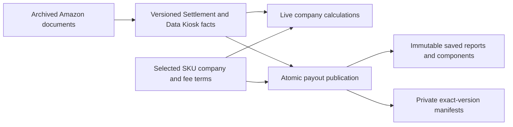
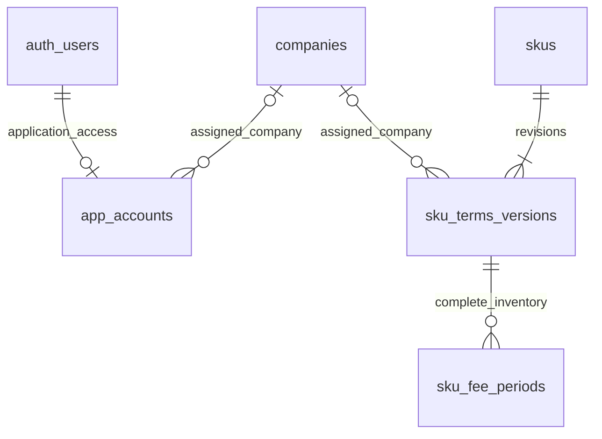
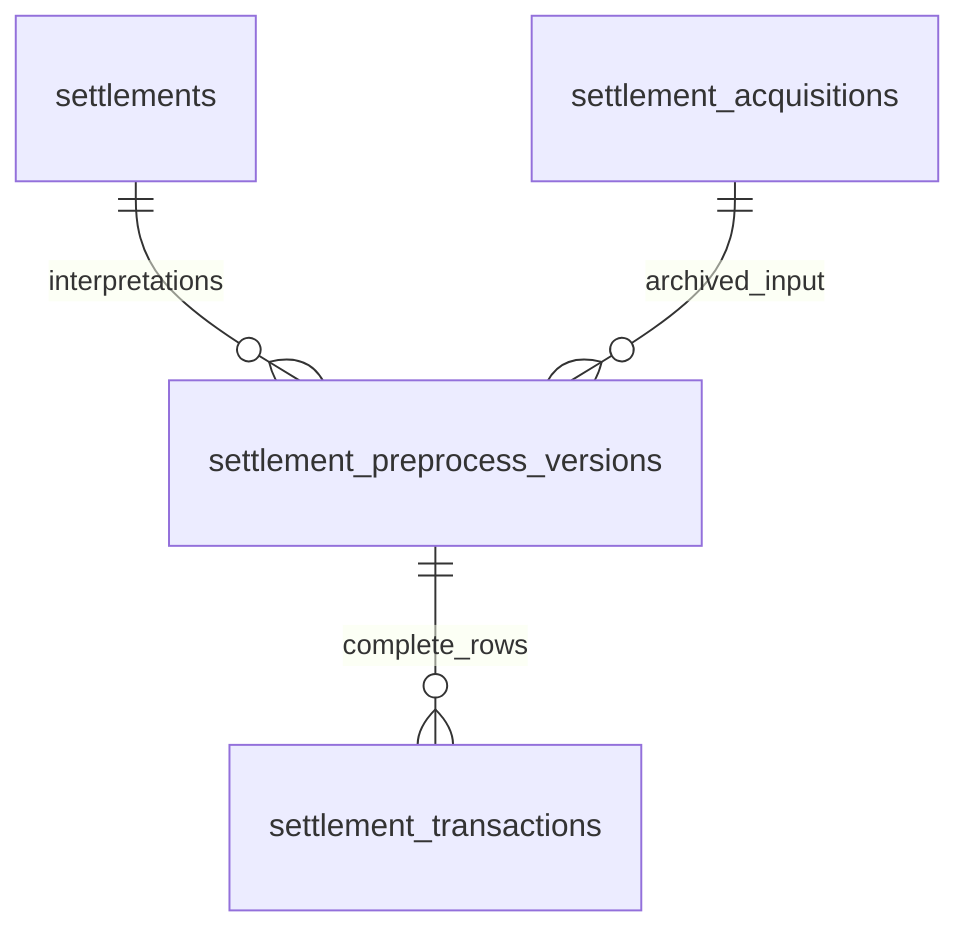
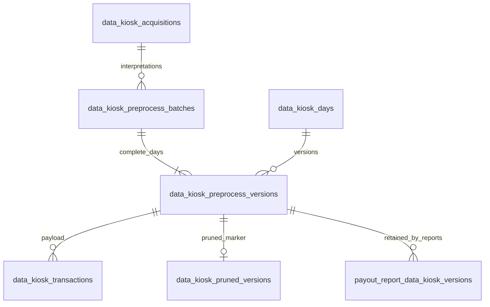

# Database schema

A-SelBox separates **archived Amazon evidence**, **complete versions of source facts**,
**company calculations made at query time**, and **frozen payout reports**.
Company assignment and fee periods are selected together in a SKU terms version.
Changing terms updates live results without rewriting source facts or saved reports.

The PostgreSQL 17/Supabase schema contains **22 application tables: 7 in `public`,
15 in `private`**. Supabase also supplies Auth and Storage tables. The
[migration modules](../services/db/supabase/README.md#schema-modules) define source/terms records,
atomic publication and retention, financial reads, frozen payouts, application access,
and revision polling in a fresh database.



Strict live totals use the privileged function
`private.company_financial_totals(...)`. The `public.live_company_components`
view also contains diagnostic rows. Dashboard estimates select only authoritative rows
under the same mature cutoff date rule as the strict source policy. They do not
certify complete imports; see the
[Transactions contract](transaction_query_contracts.md).

## Ownership and fee terms



These application tables belong to `public`; `auth_users` represents Supabase's
`auth.users`. A terms version may have no company, which is explicit unassignment.
`skus.current_terms_version_id` selects one of its own revisions. The
publisher creates a required first selection atomically with a new identity.

| Table                | What one row represents                                 | Main key or relationship                                                                      |
| -------------------- | ------------------------------------------------------- | --------------------------------------------------------------------------------------------- |
| `companies`          | A company                                               | UUIDv7 `id`; required name                                                                    |
| `app_accounts`       | One Auth user's application role and company assignment | PK `user_id` → `auth.users`; `operator` has no company, `company_member` requires one company |
| `skus`        | Stable identity for one exact SKU              | Unique `(sku)`; selected `current_terms_version_id`                         |
| `sku_terms_versions` | One complete company and all-marketplace fee revision   | Unique `(sku_id, version_number)`; nullable company FK; `fee_period_count` and reason  |
| `sku_fee_periods`    | One marketplace/date interval and percentage            | FK `terms_version_id`; nonoverlapping periods within one version and marketplace              |

Selected ownership is **exact SKU → company or unassigned**, across
marketplaces and all dates in live reads.
Application roles and user-company assignments are separate from SKU ownership;
see the [access model](access_control.md).
Source facts preserve exact SKU text and resolve ownership at read time.
The same SKU in different import
namespaces resolves to the same ownership and fee revision. This allows source
evidence to exist before an owner is assigned. Source imports do not register
company configuration. Administrators can assign or reassign a SKU through the
application. Trusted restoration may also leave a SKU unassigned; identity and
immutable revisions remain. There is no persisted Default company or global
fee-configuration version.

Fee periods use `[start, end)`: the start is included and the end is excluded.
The end may be unbounded. Rates are exact percentages from 0 through 100, with at
most six fractional digits. A complete version means the complete submitted
inventory, not guaranteed gap-free date coverage. Trusted restoration can retain
gaps or empty replacements; old versions do not fill those gaps. The administrator
publication API additionally requires every known SKU in the registry or retained source
history to have a company. Required fee dates come only from selected current source versions,
using both sources independently of the maturity cutoff. Later imports may reveal new gaps
without changing saved terms. An explicit 0% rate is valid coverage. The
[configuration contract](company_fees.md#administrator-completeness) defines eligible rows.

`company_skus` is a view of selected assigned identities, not an ownership table.
`current_sku_fee_periods` contains periods from each assigned SKU's **selected terms
version**, including historical date ranges. The source row's activity date
selects the applicable period; it does not use today's date.

Source: [ownership and fee DDL](../services/db/supabase/migrations/20260928123051_identity_schema.sql),
[ownership and fee contract](company_fees.md).

## Settlement source tables



All four source tables belong to `private`.

| Table                            | What one row represents                      | Main key or relationship                                                                                                        |
| -------------------------------- | -------------------------------------------- | ------------------------------------------------------------------------------------------------------------------------------- |
| `settlement_acquisitions`        | One successfully archived report acquisition | UUIDv7 PK; Amazon report/document IDs, API provenance, digest, and one JSONB `document` manifest                                |
| `settlements`                    | One canonical financial settlement           | Unique `(seller_namespace, amazon_scope, settlement_id)`; decoded-document digest; current version pointer                      |
| `settlement_preprocess_versions` | One complete interpretation of a settlement  | FKs to canonical settlement and acquisition; processor label, row count, report dates, currency, control total, diagnostics     |
| `settlement_transactions`        | One monetary source line in a version        | Unique `(version_id, source_line_number)`; category, SKU, amount/currency, posting date/time, original labels and fields |

The two uses of `settlement_id` differ: `settlements.settlement_id` is the **Amazon
TSV text identifier**; `settlement_preprocess_versions.settlement_id` is the
**local UUID foreign key**.

Multiple API report aliases can resolve to the same canonical settlement if the
seller, Amazon scope, TSV settlement ID, and decoded bytes agree. Conflicting
decoded content is rejected. Acquisitions have no natural unique constraint;
their relationship to a canonical settlement runs through preprocessing versions.

A settlement transaction is a monetary line, not a whole order. One order can
contribute principal, tax, shipping, promotions, and fee lines. Publication checks
the complete row inventory, one currency, and the exact signed sum against the
version's report control total.

Source: [Settlement DDL](../services/db/supabase/migrations/20260928123052_financial_source_schema.sql),
[publication functions](../services/db/supabase/migrations/20260928123102_source_publications.sql).

## Data Kiosk source tables



The six Data Kiosk source tables and the payout dependency table belong to `private`.

| Table                            | What one row represents                                      | Main key or relationship                                                                                                                       |
| -------------------------------- | ------------------------------------------------------------ | ---------------------------------------------------------------------------------------------------------------------------------------------- |
| `data_kiosk_acquisitions`        | One successful independent root-query observation            | Unique `(seller_namespace, amazon_scope, root_query_id)`; query time, requested coverage, complete ordered JSONB page inventory                |
| `data_kiosk_preprocess_batches`  | One complete publication from an acquisition                 | FK `acquisition_id`; positive `day_count`; contains all queried days                                                                           |
| `data_kiosk_days`                | One logical daily coverage slot                              | Unique `(seller_namespace, marketplace_name, activity_date, dataset_key)`; current version pointer                                             |
| `data_kiosk_preprocess_versions` | One complete day result within a batch                       | FKs to day and batch; unique `(batch_id, day_id)`; processor label, row count, normalized-content digest                                       |
| `data_kiosk_transactions`        | One normalized monetary component in a day version           | Unique `(version_id, component_key)`; SKU, date/marketplace, category/type, amount/currency, quantity, fee base, dimensions, provenance |
| `data_kiosk_pruned_versions`     | A permanent record that a version's fact payload was removed | `version_id` is PK and FK; timestamp                                                                                                           |

The key distinction is **observation versus interpretation**. Downloading a new
root query creates a new observation. Reprocessing an existing acquisition creates
a new batch and day versions, but not another independent observation.

Data Kiosk selects freshness using `(root_query_created_at, acquisition_id)`.
Reprocessing an older query cannot displace a newer observation. Reprocessing the
same observation can advance its selected result using the local version UUID.
Data Kiosk audit timestamps such as `created_at` do not select its current source version.

The current publisher accepts the `economics` dataset and requires one marketplace
per acquisition and every queried day in the batch. `amazon_scope` is acquisition
provenance; it is not part of a `data_kiosk_days` natural key.

Three states must remain distinct:

| State                     | Stored evidence                                                     | Meaning                                                      |
| ------------------------- | ------------------------------------------------------------------- | ------------------------------------------------------------ |
| Complete empty day        | Current version, `row_count = 0`, no fact rows                      | Verified empty coverage; replaces previous amounts           |
| Missing day               | No compatible current version                                       | Required coverage is unknown for both recent and mature calculations in the Data Kiosk category |
| Pruned historical version | Header and original count/hash remain; pruning marker; no fact rows | Payload was deliberately removed; this is not empty evidence |

Explicit pruning keeps at least the latest three independent observations per
day, plus every current or payout-referenced version. It removes eligible Data Kiosk fact
payloads while retaining headers, acquisitions, inventories, and archives.
Comparison checks complete normalized-content hashes for the latest three
observations; equal observations do not establish financial finality.
`payout_report_data_kiosk_versions` is the only persistent pin mechanism. Its
immutable references include empty required days and protect entire versions;
there is no standalone pin/unpin API.

Source: [Data Kiosk DDL](../services/db/supabase/migrations/20260928123052_financial_source_schema.sql),
[publication](../services/db/supabase/migrations/20260928123102_source_publications.sql),
[retention](../services/db/supabase/migrations/20260928123121_source_retention.sql),
[workflow contract](data_workflows.md).

## Archives and complete publication

The private Supabase Storage bucket `source-archives` holds content-addressed XZ
files. PostgreSQL holds their manifests: object paths, document and archive
SHA-256 hashes, byte lengths, compression settings, and API provenance. There is
**no separate application archive table and no SQL foreign key to Storage**.
Data Kiosk inventories can also contain verified `NO_DATA` pages with no document.

Upload and verification finish before publishing an acquisition. Storage uploads
and database transactions are separate, so a failed database publication can
leave an orphaned uploaded file for retry or reconciliation.

For source and fee replacements, the publisher inserts a complete new version
and child inventory, then advances the source or terms selection in the same transaction.
Expected-current checks reject stale replacements. Composite foreign keys ensure
the selected version belongs to its own settlement, day, or SKU.
Published inventories cannot later be appended to or rewritten.

Both preprocessors currently use the definition label `v1`. This label identifies
the interpretation rules; it is separate from a result's UUID and SKU terms'
numeric `version_number`. Strict reads require matching processor labels across
the declared required inputs.

Source: [database publication guide](../services/db/supabase/README.md).

## Categories, views, and company amounts

Every source fact has one `public.allocation_category`. The category describes
allocation policy; the source table alone does not determine whether a row
contributes to company totals.

| Preprocessed category | Mature authority | Recent authority |
| --- | --- | --- |
| Settlement (`SETTLEMENT`) | Settlement, assigned by exact SKU | Data Kiosk, assigned by exact SKU |
| SelBox (`SELBOX`) | Settlement, retained by SelBox | Data Kiosk, retained by SelBox |
| Data Kiosk (`DATA_KIOSK`) | Data Kiosk company amounts; Settlement is a control | Data Kiosk company amounts |
| `ANALYSIS_ONLY` | No monetary contribution | No monetary contribution |

The mature cutoff period is two calendar months. The mature cutoff date is PostgreSQL's
current UTC date minus that period. Dates before the mature cutoff date are mature;
the mature cutoff date and later are recent. For mature dates,
a derived difference per seller/day/marketplace/currency equals Settlement report amounts in
the Data Kiosk category minus Data Kiosk amounts in that category. The full ledger therefore
equals the total Settlement report amount. SelBox retains amounts in the SelBox category and
the difference; neither is allocated to customer companies.
A missing marketplace remains a separate null group. Source classifications never
change because a control has or lacks SKU. SKU-less Settlement report controls in the Data Kiosk category
are valid and do not block reports. Strict reads still require complete declared
Data Kiosk coverage and resolved company ownership/applicable fees.

`private.resolve_company_components(...)` calculates from explicit source and
terms version arrays, marks authority, and exposes source/terms/period references,
the applicable rate, and a resolution status. Frozen reports pass their captured
version UUIDs. `public.live_company_components` joins facts to current source pointers
and selected terms directly so filters can reach the fact scans. Both paths use the
same fee rules. Dashboard page RPCs select eligible rows before resolving their fees;
total RPCs combine compatible facts before fee lookup.

For fee-bearing rows:

```text
fee_amount     = -(fee_base × fee_rate_percent / 100)
company_amount = source_amount + fee_amount
```

Settlement commission uses signed `Order`/`Refund` + `ItemPrice` + `Principal`
amounts. Each row's posting date chooses its rate. Other owned components without
a commission base get fee zero when authoritative. Recent Data Kiosk net sales use
the stored fee base. Non-authoritative comparisons and analysis are excluded from monetary
totals. Comparison detail in the Settlement category and analysis detail have null fee/company
contributions. Retained rows in the SelBox category and difference rows have no company ownership and a zero company amount; authoritative retained
rows also have a zero fee. They do not require company fee configuration.

For example, with 5% coverage on both dates, a principal sale of +100 produces a
fee of −5 and company amount +95; a principal refund of −20 produces a fee of +1
and company amount −19. Amounts use exact PostgreSQL numerics, and the Python
reader preserves `Decimal`; currencies remain separate and payout rounding is
not applied here.

| Resolution status   | Meaning                                                          | Calculated fee |
| ------------------- | ---------------------------------------------------------------- | -------------- |
| `APPLIED`           | Ownership and applicable fee period found, including explicit 0% | Computed       |
| `NOT_APPLICABLE` | Owned component has no commission base, or amount is retained by SelBox | Zero when authoritative |
| `MISSING_OWNERSHIP` | No configured identity or selected company is NULL               | NULL           |
| `MISSING_FEE`       | No applicable period in the current fee version                  | NULL           |

Source constraints reject missing dates and required marketplaces before these
calculations. A stored fee-bearing row therefore already has those inputs.

`company_amount` remains NULL when a required fee or ownership resolution is
missing. The privileged `private.company_financial_totals(...)` validates the
caller-declared Settlement IDs required for mature dates and every declared Data Kiosk marketplace/day, rejects
incompatible or unresolved required input, and aggregates authoritative rows by
company and currency. Dates are inclusive. The caller supplies the required
source scope; the function does not discover an externally complete settlement
list itself.

Source: [shared financial rules and reconciliation](../services/db/supabase/migrations/20260928123106_financial_rules.sql),
[financial components](../services/db/supabase/migrations/20260928123111_financial_components.sql),
[complete and partial financial reads](../services/db/supabase/migrations/20260928123113_financial_reads.sql).

## Frozen payout tables

| Table                                       | What one row represents                                           | Main relationship                                                                               |
| ------------------------------------------- | ----------------------------------------------------------------- | ----------------------------------------------------------------------------------------------- |
| `public.company_payout_reports`             | One saved company/month aggregate, scoped by seller/currency when known     | Company FK; exact totals and immutable child counts                                             |
| `public.company_payout_report_components`   | One company amount from the Settlement or Data Kiosk category, or comparison detail | Report FK; source row/version, SKU, terms version and optional fee period; exact amounts |
| `private.payout_report_settlement_versions` | A required canonical settlement's exact version for a report      | PK `(report_id, settlement_id)`; same-settlement version FK                                     |
| `private.payout_report_data_kiosk_versions` | A required day's exact version, including empty days | PK `(report_id, day_id)`; same-day version FK; prevents payload pruning                         |
| `private.payout_report_terms_versions` | A relevant SKU's exact terms for inclusion or exclusion | PK `(report_id, sku_id)`; same-SKU terms FK |
| `private.payout_report_reconciliation` | One frozen seller/day/marketplace/currency control group | Report FK; exact category subtotals, difference, and reconciled total |

Reports contain exact totals and immutable component/manifests inventories. Their
`seller_namespace`, `currency`, and `preprocess_version` are either all present or all
null. The all-null shape represents a company/month with no known seller/currency
scope: totals and component/reconciliation counts must be zero, and `marketplace_names`
must be empty. Available source/terms manifests can still be retained. Known scopes
keep their identifiers when their amounts become zero.

The component `authoritative` flag determines the header sums. Comparison and analysis
detail can remain stored with null company/fee contributions. Terms manifests include
relevant excluded rows so validation can reconstruct the complete calculation.
`private.payout_report_reconciliation` stores seller-wide controls separately from
company components; its public invoker view is administrator-only.

`public.payout_report_marketplace_totals` groups all saved authoritative components by
report and marketplace. Its exact source, fee, and company sums reproduce the report
header, regardless of component pagination. Null marketplaces form one distinct group.
The header's `marketplace_names` describes required input coverage rather than the
marketplaces contributing payout amounts.

Commit-time validation reconstructs provenance, inventories, components, reconciliation,
and totals from frozen versions. Published rows cannot be extended, changed, or removed.
Publication fixes the related seller set for each request, locks the company/month,
then locks sellers/months and source days in stable order. A newly assigned seller is
picked up on the next request. Publication and pruning use `READ COMMITTED`; report
references protect whole source versions, including empty days.

The [payout schema](../services/db/supabase/migrations/20260928123115_payout_schema.sql),
[validation](../services/db/supabase/migrations/20260928123117_payout_validation.sql), and
[publication](../services/db/supabase/migrations/20260928123119_payout_publication.sql) modules
own these definitions. The [payout contract](company_payout_reports.md) defines the generation API, monthly
eligibility, request-only creation, empty aggregates, latest-version reuse, and access.

## Revision tokens

`private.workspace_revision_tokens` stores opaque revisions keyed by source and company scope.
Settlement and Data Kiosk tokens are global; fee/ownership/name tokens also have company scopes.
The authenticated `workspace_revisions` RPC returns the caller's stored account and only the
requested tokens. It does not expose source metadata or scan transaction history. Publications
rotate affected tokens atomically; multiple changes in one transaction share one rotation. Source
tokens also track retained-version publication and historical Data Kiosk pruning. Their returned
values include the UTC mature cutoff date, so reads refresh when source authority changes without an import.
The [frontend guide](../services/frontend/user-webpage/README.md#requests-and-session-lifecycle)
describes selective refresh and account changes.

## Access boundaries and scope

`public` is a PostgreSQL schema name, not a promise of public access. All
application tables enable row-level security. `app_accounts` and `auth.uid()`
determine the caller's `operator` or `company_member` role; a direct PostgreSQL
administrator has no application-account requirement.

Company members read all narrow current source references, their current company, selected ownership/fee terms,
current owned Settlement `SETTLEMENT` facts, and current owned Data Kiosk facts
except `SELBOX`. Operators read all retained source and terms versions, manage
member access, and publish assignment and fee changes atomically through
`publish_sku_configuration`. Each batch validates the resulting configuration for
every known SKU, including unchanged SKUs. `sku_configuration` supplies the
role-scoped current settings and required fee coverage used by the editor and
member read-only view.
Public views use `security_invoker = true`. Operator-only metadata helpers expose
complete historical headers while member grants retain only necessary opaque
selection/version columns. Reference visibility does not grant access to transaction
amounts or full metadata. Raw archives remain outside application access.

Current ownership policies use the private caller-bound `current_owned_sku_terms()` helper to
obtain allowed SKU keys and selected terms IDs together. It resolves the stored account and
current pointers under definer security; invoker views and RPCs still enforce the resulting row
policies. Page and totals queries further restrict their financial terms projection to the selected
page or grouped facts. This changes execution work, not the tables or visibility contract.

Operators generate and read payout reports for any company and eligible month. Company
members read only their assigned company's saved headers and components, even after a
SKU changes owner; they cannot generate reports. Exact source/terms input manifests
remain operator-only. Source publication, pruning, and trusted terms restoration
remain direct-database operations. Guarded public RPCs provide administrator
configuration and monthly payout publication, including their completeness checks.
Storage service-role access is separate from PostgreSQL administration.

The [application-access contract](access_control.md) lists each REST endpoint,
permission, and role-management restriction. Supabase's
[RLS documentation](https://supabase.com/docs/guides/database/postgres/row-level-security)
explains how grants and row policies work together.

Payout approvals, currency rounding, payment execution, and refund commission
over-credit treatment remain deferred. A selected source or terms change may
restate live history; immutable saved reports preserve the original calculation
without establishing that a payment was approved or made.

Source: [access policies](../services/db/supabase/migrations/20260928123123_application_access.sql),
[known limitations](known_issues.md).
