# Database schema

The canonical fresh-install migrations define **26 application tables, 258 columns, 31 foreign keys,
and 23 ordinary views**. Each object has one maintained definition. Supabase-managed Auth/Storage
internals are shown only at their application boundaries.

The three inventory tables implement the
[daily-capture workflow](inventory_daily_captures.md): one preprocessed capture per source
scope/day, with immutable raw archives and no dependency on financial calculations.

This is the schema reference, including every application column and key. See
[data workflows](data_workflows.md) for publication and retention,
[source allocation](source_allocation.md) for financial authority, [company terms](company_fees.md)
for ownership/fees, [payouts](company_payout_reports.md) for frozen reports, and
[application access](access_control.md) for RLS and permissions. The
[database guide](../services/db/supabase/README.md#schema-modules) lists current migration files in
dependency order and the fresh-install verification commands.

## Figure index

- [Complete database relationship map](figures/database/01-overview.svg)
- [Ownership, fees, and access](figures/database/02-ownership.svg)
- [Settlement archives, versions, and facts](figures/database/03-settlements.svg)
- [Data Kiosk acquisitions and complete-day versions](figures/database/04-data-kiosk-observations.svg)
- [Data Kiosk facts and retention](figures/database/05-data-kiosk-facts.svg)
- [Payout results, reconciliation, and refresh state](figures/database/06-payout-results.svg)
- [Payout manifests and exact-version references](figures/database/07-payout-manifests.svg)
- [Workspace revision tokens](figures/database/08-revisions.svg)
- [Daily inventory: all columns](figures/database/09-daily-inventory.svg)
- [Daily acquisition and preprocessing](figures/database/10-inventory-workflow.svg)
- [Derived views and read dependencies](figures/database/11-views.svg)

Each figure has one editable `.mmd` source next to its SVG export.

## Reading the figures

`NN` means NOT NULL, `NULL` means nullable, and repeated PK markers form a composite primary key. FK
markers can be members of a composite FK; exact tuples are listed below. In the overview, solid
arrows run from child to referenced table and dotted arrows are non-FK dependencies. In ER figures,
solid/dotted edges mean identifying/non-identifying FKs; circles mean optional and crow's feet mean
many. A `(reference)` box shows only its primary key; all its columns appear in its own full figure.
Domain names are shortened inside boxes.

## 1. Complete database relationship map

[Full-size SVG](figures/database/01-overview.svg)

[Editable Mermaid source](figures/database/01-overview.mmd)

## 2. Ownership, fees, and access

[Full-size SVG](figures/database/02-ownership.svg)

[Editable Mermaid source](figures/database/02-ownership.mmd)

## 3. Settlement archives, versions, and facts

[Full-size SVG](figures/database/03-settlements.svg)

[Editable Mermaid source](figures/database/03-settlements.mmd)

## 4. Data Kiosk acquisitions and complete-day versions

[Full-size SVG](figures/database/04-data-kiosk-observations.svg)

[Editable Mermaid source](figures/database/04-data-kiosk-observations.mmd)

## 5. Data Kiosk facts and retention

[Full-size SVG](figures/database/05-data-kiosk-facts.svg)

[Editable Mermaid source](figures/database/05-data-kiosk-facts.mmd)

## 6. Payout results, reconciliation, and refresh state

[Full-size SVG](figures/database/06-payout-results.svg)

[Editable Mermaid source](figures/database/06-payout-results.mmd)

`private.payout_report_refresh_state` is mutable operational state for the scheduled worker,
keyed by company and calendar month. Requested/completed revisions identify pending work;
a partial index selects due requests without revisiting completed reports. A pending future
month per company lets the worker discover newly mature work. Retry time and failure count
control backoff, alongside the latest attempt, success, and error SQLSTATE/message. It is
protected by RLS and has no application-role grants. Frozen reports, components, and their
source/terms manifests remain immutable. Headers aggregate all source namespaces
for one company/month/currency; pinned source manifests retain namespace and
preprocessing provenance. The [payout contract](company_payout_reports.md)
describes invalidation and scheduler operations.

## 7. Payout manifests and exact-version references

[Full-size SVG](figures/database/07-payout-manifests.svg)

[Editable Mermaid source](figures/database/07-payout-manifests.mmd)

## 8. Workspace revision tokens

[Full-size SVG](figures/database/08-revisions.svg)

[Editable Mermaid source](figures/database/08-revisions.mmd)

`private.workspace_revision_tokens` stores opaque tokens for `settlement`, `data_kiosk`, `fees`,
`inventory`, and `payouts`. Inventory reuses this table without adding columns: a changed daily capture
publication rotates its global token in the same transaction. Raw acquisitions, idempotent replays,
and rolled-back publications leave the token unchanged. Ownership uses the existing `fees` token,
company-scoped for members and global for operators. New payout reports rotate the separate
`payouts` token for their company and the global scope; unchanged report reuse does not.

The authenticated `workspace_revisions` RPC reads requested tokens without scanning source facts or
inventory captures. The browser checks inventory and ownership tokens before reloading active
inventory rows; unchanged tokens retain successful cached reads. Inventory revision checks have no
financial mature-cutoff suffix. Payout reads likewise check their own token before reloading
saved results, without scanning report components during unchanged checks.

## 9. Daily inventory: all columns

[Full-size SVG](figures/database/09-daily-inventory.svg)

[Editable Mermaid source](figures/database/09-daily-inventory.mmd)

## 10. Daily acquisition and preprocessing

[Full-size SVG](figures/database/10-inventory-workflow.svg)

[Editable Mermaid source](figures/database/10-inventory-workflow.mmd)

## 11. Derived views and read dependencies

[Full-size SVG](figures/database/11-views.svg)

[Editable Mermaid source](figures/database/11-views.mmd)

## Primary and unique keys

| Table                                       | Primary key                  | Additional unique constraints                                                                       |
| ------------------------------------------- | ---------------------------- | --------------------------------------------------------------------------------------------------- |
| `public.companies`                          | `(id)`                       | None                                                                                                |
| `public.app_accounts`                       | `(user_id)`                  | None                                                                                                |
| `public.skus`                               | `(id)`                       | (sku)                                                                                               |
| `public.sku_terms_versions`                 | `(id)`                       | (sku_id, version_number); (sku_id, id)                                                              |
| `public.sku_fee_periods`                    | `(id)`                       | (terms_version_id, id)                                                                              |
| `private.settlement_acquisitions`           | `(id)`                       | None                                                                                                |
| `private.data_kiosk_acquisitions`           | `(id)`                       | (seller_namespace, amazon_scope, root_query_id)                                                     |
| `private.settlements`                       | `(id)`                       | (seller_namespace, amazon_scope, settlement_id)                                                     |
| `private.settlement_preprocess_versions`    | `(id)`                       | (settlement_id, id)                                                                                 |
| `private.settlement_transactions`           | `(id)`                       | (version_id, source_line_number)                                                                    |
| `private.data_kiosk_days`                   | `(id)`                       | (seller_namespace, marketplace_name, activity_date, dataset_key)                                    |
| `private.data_kiosk_preprocess_batches`     | `(id)`                       | None                                                                                                |
| `private.data_kiosk_preprocess_versions`    | `(id)`                       | (day_id, id); (batch_id, day_id)                                                                    |
| `private.data_kiosk_transactions`           | `(id)`                       | (version_id, component_key)                                                                         |
| `private.data_kiosk_pruned_versions`        | `(version_id)`               | None                                                                                                |
| `public.company_payout_reports`             | `(id)`                       | None                                                                                                |
| `private.payout_report_refresh_state`       | `(company_id, month)`         | None                                                                                                |
| `private.payout_report_settlement_versions` | `(report_id, settlement_id)` | (report_id, version_id)                                                                             |
| `private.payout_report_data_kiosk_versions` | `(report_id, day_id)`        | (report_id, version_id)                                                                             |
| `private.payout_report_terms_versions`      | `(report_id, sku_id)`        | (report_id, terms_version_id)                                                                       |
| `public.company_payout_report_components`   | `(id)`                       | (report_id, row_number); (report_id, source, source_row_id)                                         |
| `private.payout_report_reconciliation`      | `(report_id, row_number)`    | (report_id, activity_date, marketplace_name, currency) NULLS NOT DISTINCT                           |
| `private.workspace_revision_tokens`         | `(source, scope_company_id)` | None                                                                                                |
| `private.inventory_acquisitions`            | `(id)`                       | (seller_namespace, amazon_scope, report_id); (seller_namespace, marketplace_name, capture_date, id) |
| `private.inventory_daily_captures`          | `(id)`                       | (seller_namespace, marketplace_name, capture_date)                                                  |
| `private.inventory_items`                   | `(capture_id, sku)`          | (capture_id, source_line_number)                                                                    |

`sku_fee_periods` also excludes overlapping validity ranges within a terms version/marketplace.

## Foreign keys

| Referencing table / columns                                                                           | Referenced table / columns                                                              |
| ----------------------------------------------------------------------------------------------------- | --------------------------------------------------------------------------------------- |
| `public.app_accounts (user_id)`                                                                       | `auth.users (id)`                                                                       |
| `public.app_accounts (company_id)`                                                                    | `public.companies (id)`                                                                 |
| `public.sku_terms_versions (sku_id)`                                                                  | `public.skus (id)`                                                                      |
| `public.sku_terms_versions (company_id)`                                                              | `public.companies (id)`                                                                 |
| `public.sku_fee_periods (terms_version_id)`                                                           | `public.sku_terms_versions (id)`                                                        |
| `private.settlement_preprocess_versions (settlement_id)`                                              | `private.settlements (id)`                                                              |
| `private.settlement_preprocess_versions (acquisition_id)`                                             | `private.settlement_acquisitions (id)`                                                  |
| `private.settlement_transactions (version_id)`                                                        | `private.settlement_preprocess_versions (id)`                                           |
| `private.data_kiosk_preprocess_batches (acquisition_id)`                                              | `private.data_kiosk_acquisitions (id)`                                                  |
| `private.data_kiosk_preprocess_versions (day_id)`                                                     | `private.data_kiosk_days (id)`                                                          |
| `private.data_kiosk_preprocess_versions (batch_id)`                                                   | `private.data_kiosk_preprocess_batches (id)`                                            |
| `private.data_kiosk_transactions (version_id)`                                                        | `private.data_kiosk_preprocess_versions (id)`                                           |
| `private.data_kiosk_pruned_versions (version_id)`                                                     | `private.data_kiosk_preprocess_versions (id)`                                           |
| `public.company_payout_reports (company_id)`                                                          | `public.companies (id)`                                                                 |
| `private.payout_report_refresh_state (company_id)`                                                    | `public.companies (id)`                                                                 |
| `private.payout_report_settlement_versions (report_id)`                                               | `public.company_payout_reports (id)`                                                    |
| `private.payout_report_settlement_versions (settlement_id, version_id)`                               | `private.settlement_preprocess_versions (settlement_id, id)`                            |
| `private.payout_report_data_kiosk_versions (report_id)`                                               | `public.company_payout_reports (id)`                                                    |
| `private.payout_report_data_kiosk_versions (day_id, version_id)`                                      | `private.data_kiosk_preprocess_versions (day_id, id)`                                   |
| `private.payout_report_terms_versions (report_id)`                                                    | `public.company_payout_reports (id)`                                                    |
| `private.payout_report_terms_versions (sku_id, terms_version_id)`                                     | `public.sku_terms_versions (sku_id, id)`                                                |
| `public.company_payout_report_components (report_id)`                                                 | `public.company_payout_reports (id)`                                                    |
| `public.company_payout_report_components (report_id, terms_version_id)`                               | `private.payout_report_terms_versions (report_id, terms_version_id)`                    |
| `public.company_payout_report_components (sku_id, terms_version_id)`                                  | `public.sku_terms_versions (sku_id, id)`                                                |
| `public.company_payout_report_components (terms_version_id, fee_period_id)`                           | `public.sku_fee_periods (terms_version_id, id)`                                         |
| `private.payout_report_reconciliation (report_id)`                                                    | `public.company_payout_reports (id)`                                                    |
| `public.skus (id, current_terms_version_id)`                                                          | `public.sku_terms_versions (sku_id, id)`                                                |
| `private.settlements (id, current_version_id)`                                                        | `private.settlement_preprocess_versions (settlement_id, id)`                            |
| `private.data_kiosk_days (id, current_version_id)`                                                    | `private.data_kiosk_preprocess_versions (day_id, id)`                                   |
| `private.inventory_daily_captures (seller_namespace, marketplace_name, capture_date, acquisition_id)` | `private.inventory_acquisitions (seller_namespace, marketplace_name, capture_date, id)` |
| `private.inventory_items (capture_id)`                                                                | `private.inventory_daily_captures (id)`                                                 |

Inventory has no FK to SKU ownership or payout inputs. Its daily capture references the
matching acquisition scope/date, and deleting a replaced capture cascades to its item rows.
Deleting a company also removes its operational payout refresh state; saved financial reports
retain their ordinary restrictive company reference.

## Integrity and access boundaries

Source records resolve ownership through exact `sku`, not seller-qualified SKU. There is no
source-item FK to `public.skus` and no source company ID. Selected terms use an own-SKU composite FK
and are required at commit, although the pointer is nullable during publication. Source identities
may have no selected version.

Original bytes remain in private Storage through JSON manifests, with no SQL FK to Storage objects.
Financial versions and payout evidence retain their existing immutability/retention policies.
Inventory instead permits trusted atomic daily replacement: delete the old normalized capture/items
while retaining raw evidence.

Payout component source IDs are polymorphic provenance validated by publication, not direct SQL FKs
to either financial source. Typed payout manifests do have composite version FKs and protect
financial evidence. No inventory pin or monetary reconciliation is introduced.

Company members read current owned live data and their own frozen reports; operator access includes
additional history and control manifests. Inventory uses RLS, operator-only acquisition/capture tables, and
a caller-checked private helper for minimal latest-capture metadata. Members see NULL seller namespaces;
item ownership is enforced independently, after selecting the latest source scopes. Public schema does not mean public access. Revision-token company scope is
not a company FK: ordinary UUID permits the global nil UUID.

## Views

The schema defines 21 invoker-security views, not additional tables:

- `private.current_sku_terms`
- `public.company_skus`
- `public.current_sku_fee_periods`
- `private.source_reconciliation_inputs`
- `private.live_source_reconciliation`
- `private.live_company_component_inputs`
- `public.live_company_components`
- `public.settlement_preprocess_results`
- `public.data_kiosk_preprocess_results`
- `public.settlement_preprocess_entries`
- `public.data_kiosk_preprocess_entries`
- `public.payout_report_marketplace_totals`
- `public.latest_company_payout_reports`
- `public.payout_report_reconciliation`
- `public.financial_review_records`
- `public.payout_reconciliation_totals`
- `public.payout_report_settlement_versions`
- `public.payout_report_data_kiosk_versions`
- `public.payout_report_terms_versions`
- `public.latest_inventory_captures`
- `public.latest_inventory_items`

`public.latest_company_payout_reports` selects the newest immutable report for
each company, month, and currency. Source namespaces remain in its pinned inputs;
they do not create separate report groups. The full report table retains history.

`public.financial_review_records` retains current mature rows from both sources in each of the three
monetary categories, without ownership or fee joins. It is explicitly operator-gated. The stable
invoker RPCs `financial_review_totals(date,date,allocation_category)` and
`financial_review_type_totals(date,date,allocation_category,text)` apply direct activity-date bounds
before aggregation. Their half-open month ranges preserve existing date indexes under RLS; neither
RPC changes accounting classifications, maturity, or saved payout data.

The [Financial review](financial_review.md) interfaces are operator-only. Current
comparisons aggregate mature source facts by category, month, and currency across
namespaces and marketplaces. Exact source records preserve provenance. The saved
reconciliation views aggregate one frozen report's account controls by currency or
expose its daily controls; they do not add repeated controls across company reports.
Company members can read only authoritative frozen payout components, while operators
retain access to saved comparison rows.

`public.latest_inventory_items` selects the latest successful capture per
seller/marketplace before joining its SKU rows. It joins ownership by exact SKU alone. Missing rows
do not inherit older per-SKU observations. This read model has no dependency on financial totals or
payout RPCs. Its nullable integer `health_status_urgency` and `recommended_action_urgency` columns
derive application ordering priorities from recognized source labels; they are not stored in the
inventory tables or supplied by Amazon. Higher values are more urgent, and unknown labels remain
unranked. The [inventory read contract](inventory_daily_captures.md#dates-latest-reads-and-access)
defines the ordering and aliases.

## Domains, enums, and important checks

| Type                         | Meaning                                                   |
| ---------------------------- | --------------------------------------------------------- |
| `public.local_uuid`          | UUIDv7 domain used for local application identities       |
| `private.nonblank`           | Nonblank text                                             |
| `private.sha256`             | 64 lowercase hexadecimal characters                       |
| `private.exact_numeric`      | Finite source numeric bounded to 1,000 fixed-point digits |
| `private.calculated_amount`  | Finite calculated numeric without the source-value bound  |
| `public.allocation_category` | `SETTLEMENT`, `SELBOX`, `DATA_KIOSK`, `ANALYSIS_ONLY`     |
| `public.app_access_role`     | `operator`, `company_member`                              |

Marketplace names use checked text. Inventory metrics use nullable ordinary finite numerics/unit
counts, not financial amount domains or allocation categories. Payout headers may have
NULL currency only for a valid empty company-month report. Nonempty reports keep
their currencies separate and combine all contributing source namespaces.
