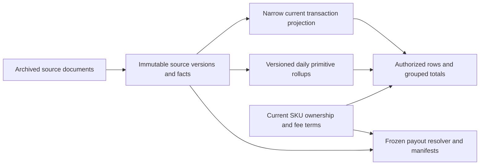

# Fresh-schema design review

Reviewed September 23, 2026; implementation status updated September 25. PostgreSQL 17 is the
configured target. The approved refactor consolidates the migrations into a fresh-install baseline
and shared read rules while preserving all existing tables, constraints, access rules, and
financial/publication guarantees. The subsequent read-index selection changes optional access paths
without changing SQL functions or those guarantees. Existing seeded data is retained; the baseline
is not an upgrade chain to replay against that database.

The [database module map](../services/db/supabase/README.md#schema-modules) identifies canonical
current definitions. The [transaction query contracts](transaction_query_contracts.md) describe
pages, counts, totals, options, exact values, and RLS. Measured page/count improvements, native enum
filters, both date directions, dedicated summary/option RPCs, and disabled general REST aggregates
are implemented. Superseded executable query candidates and intermediate migration definitions have
been removed; dated reports and sanitized JSON remain evidence.

The [date-page experiments](evidence/ordered_pages_2026-09-25/README.md),
[million-row REST measurements](evidence/current_transaction_queries_2026-09-25/README.md), and
[dedicated aggregation measurements](evidence/dedicated_aggregation_2026-09-25/README.md) retain
their original checkpoints. New measurements use the
[maintained harness](../services/db/supabase/benchmarks/README.md).

The broader redesign ideas below are retained from the earlier review. They are conditional
proposals, not changes included in this refactor or alterations to the current guarantees.

A new serving projection remains a later option if residual authorization or aggregate costs justify
its maintenance. Keep the immutable evidence and publication model in either case.

## Earlier review priorities and implementation status

This table retains the earlier review's conditional proposals; the implemented rows identify this
refactor's scope. “Concrete” means the behavior follows from the reviewed implementation or retained
evidence. “Measured” refers to the named, dated query/index checkpoint. “Proposed” means the benefit
still needs a benchmark.

| Priority                     | Suggestion                                                                       | Basis                                                 | Main cost or tradeoff                                 |
| ---------------------------- | -------------------------------------------------------------------------------- | ----------------------------------------------------- | ----------------------------------------------------- |
| Before production            | Cover historical imports and pruning in admin revision signals                   | Concrete freshness gap                                | More precise invalidation dependencies                |
| Implemented read improvement | Bound eligible candidates before metadata joins; count facts directly            | Implemented after measurements and equivalence checks | Preserve specialized query and permission regressions |
| Conditional read redesign    | Keep immutable history; consider a narrow current transaction projection         | Proposed for remaining authorization/aggregate cost   | Additional storage and atomic publication work        |
| Conditional foundation       | Separate seller/SKU identity from ownership; use stable identity keys in reads   | Concrete repeated text joins; proposed improvement    | Identity registration and authorization redesign      |
| Fresh foundation             | Establish a deliberate API schema, default privileges, and resource budgets      | Hardening and maintainability                         | Explicit grants and deployment configuration          |
| Before multiple writers      | Use per-identity revisions and idempotent publication requests                   | Concrete clock-order/retry limitations                | Request ledger, audit metadata, and concurrency tests |
| High read-volume candidate   | Store versioned daily primitive rollups                                          | Proposed                                              | Extra publication work; exact equivalence required    |
| Implemented index selection  | Keep reversible date keys and compact SKU/Type prefixes; remove redundant paths  | Per-source query and storage tradeoffs                | RLS and selectivity still govern index use            |
| Before large retention runs  | Bound pruning work and define retention of repeated interpretations              | Concrete growth and transaction-scope behavior        | Explicit retention policy and batch scheduling        |
| Before expanding writers     | Strengthen source provenance checks at publication                               | Concrete checks currently supplied by Python          | More relational metadata and validation               |
| Measure next                 | Bound operator history reads and optimize bulk/report publication                | Concrete query shapes; unmeasured cost at scale       | More specialized APIs and staging                     |
| Implemented maintainability  | One canonical definition and shared current read rules                           | Consolidated baseline and current API contracts       | Preserve dated evidence and existing seeded data      |
| Defer until justified        | Partitioning, cursors, persisted fee-adjusted amounts, additional infrastructure | Workload dependent                                    | Substantial additional complexity                     |

## What should remain

The current design already has important guarantees. A rewrite should preserve them explicitly:

- Complete immutable source versions, content-addressed archives, and expected-current checks.
  Advancing a pointer and publishing its complete child inventory are atomic.
- Composite foreign keys that prevent a settlement, day, or seller/SKU from selecting another
  identity's version.
- Exact numeric amounts, separate currencies, nonoverlapping `[start, end)` fee periods, and
  distinct missing, non-applicable, and explicit-zero fees.
- Current ownership semantics: reassigning a SKU changes its live historical visibility and
  calculations. It does not rewrite source evidence or a saved payout.
- Complete empty days, missing coverage, and pruned historical payloads remain different states.
- Database-backed account permissions, invoker-security application views, and narrowly gated
  private privileged functions. Browser requests remain REST/RPC requests with the user's token.
- Immutable payouts with typed source/terms manifests, independent validation, and protection
  against concurrent pruning.
- Stable lock ordering and checks performed again after acquiring locks.

The explicit-version resolver and strict completeness functions are **active financial
functionality**, not obsolete code. Dashboard estimates intentionally combine the displayed sources;
they are a different contract from strict payout calculations. This review does not propose changing
that product decision or the chosen Latest month rule.

Sources: [source schema][schema], [publication][publication], [financial reads][reads],
[payouts][payouts], and [application access][access].

## Why the current read path still costs time

The latest implementation already fixes several earlier problems: filters reach relational source
reads, authorized source versions are selected as a set, and date-ordered pages choose bounded
source facts before metadata/ownership projection and fee resolution. Exact counts read eligible
facts directly. Native enum filters and one full reversible date/ID index per source are in place,
alongside compact SKU/date and Type/date prefixes. Data Kiosk retains a marketplace/date path for
privileged backend reads. The unchanged Settlement owner/version index also carries category and
marketplace keys, allowing index-only counts when heap visibility permits. The count function plans
its current-policy guards from known Boolean values. These are implemented improvements to retain,
not suggestions to implement again. At the recorded page/count optimization checkpoint, the newest
25 rows on the multi-year million-row fixture arrived over local REST in 231 ms for a member and 9
ms for an operator; rows plus a sequential uncached exact count completed in 571 and 173 ms
respectively. Those five-run warm medians do not establish production concurrency or cold-cache
capacity.

The older
[page-query plans](evidence/page_first_transactions_2026-09-23/README.md#why-counting-was-expensive)
processed 37,056 Settlement and 9,342 Data Kiosk rows in the member example to produce a 25-row
page. They diagnosed why reducing fee work alone was insufficient; they are not the current plan.

The newer [date-page experiment](evidence/ordered_pages_2026-09-25/README.md) narrows this
diagnosis. On a synthetic 1,032,440-fact, ten-cohort fixture spanning 2017–2026, delaying metadata
joins reduced a member's newest-first page from 1,089 to 302 ms and an operator's from 885 to 3.3
ms, using the existing indexes. These are warm local SQL timings for rows only, not HTTP timings or
counts. Simply putting a limit on each source's existing joined view did little. The placement of
the joins and limit matters more than the presence of `LIMIT` alone.

The integrated query also avoids one duplicate current-version check when the authenticated member
fact policy already enforces it and fact RLS is active; other contexts retain the check. That is a
dependency on the reviewed policy contract, not an access-policy change. Its historical separate
measurements and mutation tests remain in the benchmark report. Remaining member startup work still
constructs authorized version sets, so the improvement does not establish constant-time behavior as
history grows.

The [progressive-count experiment](evidence/progressive_counts_2026-09-23/README.md#database-cost)
illustrates the distinction between responsiveness and database capacity. On the 1,032,440-fact
member fixture, deferred counting delivered rows in 1,163 ms instead of 1,483 ms, but summed backend
execution rose from 1,472 to 2,208 ms on a cache miss. Those are local synthetic measurements, not
production latency guarantees or CPU measurements.

An exact filtered count must account for visible, authorized, matching rows. It is normal to use
`COUNT`; the expensive part here is the relation being counted. Indexes can make selective access
cheaper, but cannot turn every arbitrary filtered count into a constant-time lookup. Separate counts
and revision caching remain useful; they are not a substitute for simplifying that relation.

## 1. Separate immutable history from current serving data

The complete calculated view still uses the
[input view](../services/db/supabase/migrations/20260912072704_live_company_reads.sql), which joins
facts to current pointers and selected ownership. The optimized page/count RPCs read eligible source
facts directly; only selected page rows receive metadata and fee decoration. Member authorization
can still scan historical facts to construct permitted current-version sets.

If the optimized current-schema read still misses the capacity target, I would prototype a **private
current transaction projection** containing only current, normalized transaction inputs. It is no
longer the first step for faster date pages. Keep wide source fields, native dimensions, and
acquisition provenance in immutable history. The projection would contain the source/row/version
identity, seller-SKU identity, date, marketplace, type/category, currency, source amount, quantity,
and fee base.

Publishing a replacement would update the affected current projection, its selected-version pointer,
and its revision signal in the same transaction. A failed replacement must expose none of the new
projection. Retain typed links to the original source versions; do not replace enforceable
provenance with an unchecked `(source, arbitrary_id)` convention.

Initially, **join current ownership and fees at read time**. Do not copy company ownership into
immutable facts. Do not start by caching every fee-adjusted amount: a retroactive rate edit would
require invalidating large historical ranges, and the current page path already calculates fees for
only the displayed rows.

This trades duplicate narrow storage and publication writes for simpler reads and more direct
indexes. Protect the projection itself with RLS and explicit grants; copying rows does not copy the
original security model. The proof required is exact row equivalence across current-version
replacement, reassignment, explicit unassignment, missing fees, and operator diagnostics.

## 2. Make seller/SKU identity independent of fee configuration

The
[existing seller-SKU table](../services/db/supabase/migrations/20260912072531_live_source_versions.sql)
is created through terms publication. Facts instead repeat seller namespace and raw SKU, and the
[current read](../services/db/supabase/migrations/20260912072704_live_company_reads.sql) joins those
strings to ownership. The
[header authorization helper](../services/db/supabase/migrations/20260914094640_application_access.sql)
derives permitted source versions by scanning facts for the caller's owned SKUs.

I would register stable seller/SKU identities independently of company assignment and reference
their IDs from canonical facts or the current projection. An identity may exist with no configured
owner or fee terms. This requires deliberately changing the current rule that every `seller_skus`
identity has a selected first terms version; importing an observed SKU must not silently create
business configuration.

Preserve exact raw SKU spelling, case, whitespace, seller scope, and Unicode identity. Two sellers
using `ABC` are different identities. Account-level rows with no SKU remain valid where the current
category rules permit them.

If retaining the existing historical-table read architecture, a smaller intermediate improvement is
a private, source-specific **version-to-SKU membership relation**, maintained during publication.
Header policies could read distinct membership instead of rediscovering it from every fact. Include
only categories that members are allowed to see, and retain narrow header column grants. Membership
must resolve against current ownership, not import-time company IDs.

These are related options, not a requirement to add every projection immediately. Benchmark the
narrow current model first, then retain a membership map only where source-history APIs still need
it. Also review the remaining
[row-argument SKU permission function](../services/db/supabase/migrations/20260914094640_application_access.sql);
a caller-owned SKU set can avoid repeated catalog lookups. Wrapping a row-dependent call in `SELECT`
does not make its argument independent of each row.

## 3. Aggregate primitives once for repeated summaries

The implemented
[totals RPC](../services/db/supabase/migrations/20260925065538_transaction_totals.sql) filters a
requested date range and combines compatible facts before fee lookup. The
[options RPC](../services/db/supabase/migrations/20260925065540_dataset_filter_options.sql) reads
distinct eligible source values without financial decoration. Neither uses the complete calculated
view for its live path, and neither requests a second exact source-row count.

The remaining optional design is persistent primitive rollups, which would move repeated grouping
work from reads into source publication. No rollup table or publication change is included here.

A useful candidate is a versioned rollup at:

`source version × seller-SKU × day × marketplace × currency × type/category × fee-applicability`

Store exact source-amount sums, fee-base sums, source row counts, and counts needed to distinguish
applicable and non-applicable amounts. Select current source versions and apply current ownership
and fee periods to those groups. Keep source and strict-allocation information so dashboard
estimates and payout scope cannot be confused.

For example, 1,000 same-day rows for one SKU, marketplace, currency, type, and fee rule can be
represented by one group. With the current unrounded linear formula, summing the fee bases and
applying that day's rate can produce the same exact fee as summing the individual fees. This
requires identical applicability and rate within the group; a bucket must not turn a missing fee
into zero or treat `SUM(NULL)` as complete information.

Apply the Data Kiosk zero-row exclusion **before every dashboard primitive sum and count**,
including the fee-base sum; retain Settlement zero rows. A hidden zero-amount Kiosk row may still
carry a nonzero fee base, so filtering only the count would change the fee total. Use
aggregate-appropriate numeric bounds: sums of valid inputs can exceed the source domain's per-input
1,000-digit cap. Preserve raw type identities, separate currencies, and unresolved-amount counts.
Current company/SKU/marketplace and selected-date behavior remain unchanged. If persisted rollups
are later justified, the dedicated totals RPC can read them without changing its API contract.

Compatible filters can count by summing bucket row counts. Arbitrary text searches or predicates on
calculated row amounts still need their own exact path. Do not replace strict coverage validation or
frozen payout evidence with these estimates.

The improvement depends on compression: if almost every transaction has a unique grouping tuple,
rollups add work without shrinking reads enough. Measure group cardinality, publication overhead,
and concurrent summary cost before adopting them.

## 4. Align filter types and indexes

The reviewed page/count RPCs accepted marketplace parameters as `text[]` and cast the enum column to
text, while existing marketplace/date indexes stored the native enum. The September 25 benchmark
converted known labels through `enum_range` to compare native types while preserving the previous
unknown-label behavior.

The user subsequently chose a strict typed contract. The current
[page/count APIs](transaction_query_contracts.md) accept `public.amazon_marketplace_name[]` and
compare enums directly. JSON requests remain string arrays; unknown labels now fail input
validation, including mixed valid/invalid selections. Null and empty selections still mean no
marketplace restriction. No compatibility overload remains. This resolves the type mismatch without
changing stored facts or access rules; the original benchmark timings do not measure this final API
signature separately.

The selected optional index family is asymmetric where the workloads differ:

- Both source tables retain a full ascending `(date, id)` index. Reversing the complete date/ID
  order permits forward and backward scans, including historical and account rows in raw tabs.
- Both add compact `(sku, date)` and `(component_type, date)` indexes. These match the frontend's
  exact SKU/Type selections, which do not supply a seller namespace.
- Data Kiosk retains `(marketplace_name, date)` for privileged backend financial reads. Settlement
  drops its marketplace/date index.
- Both retain the existing ownership/version eligibility indexes and drop the former
  `(seller_namespace, sku, date)` indexes. Current-pointer indexes, primary/unique constraints,
  and fee-period GiST exclusion remain unchanged.

The compact SKU/Type indexes omit unique row IDs. Repeated key/date pairs can share B-tree posting
lists; a unique ID tail removes that storage benefit. Some filtered pages may consequently need an
additional sort or merge, so the decision balances their measured access benefit against index size.
[B-tree deduplication](https://www.postgresql.org/docs/17/btree.html#BTREE-DEDUPLICATION)

Native marketplace arguments fix type alignment, but PostgreSQL 17's `enum_eq` is not leakproof. RLS
security ordering can keep an otherwise index-compatible marketplace comparison above the fact scan.
Authenticated UI requests and privileged backend reads therefore need separate plan checks; the Data
Kiosk marketplace index is retained for the latter. Neither enum types nor access rules are changed
to force an index path.
[PostgreSQL 17 enum catalog](https://github.com/postgres/postgres/blob/REL_17_STABLE/src/include/catalog/pg_proc.dat),
[RLS and leakproof predicates](https://www.postgresql.org/docs/17/sql-createfunction.html)

Separate ascending/newest-first date counterparts and amount-ordering indexes are removed. Reported
amount ordering instead enforces the 10,000-match limit after filters/search/RLS and sorts only that
bounded result. The earlier two-direction and amount-index measurements remain historical evidence;
they do not describe this layout. See the
[current index access paths](transaction_query_contracts.md#index-access-paths). Exact counts and
aggregates retain their matching-row cost, and no index is expected to appear in every role/filter
plan. The [balanced-index evidence](evidence/balanced_read_indexes_2026-09-25/README.md) records the
final selection and measured tradeoffs.

If a current projection is later justified, benchmark a small index family:

| Access path                   | Candidate key shape                                                | Qualification                                     |
| ----------------------------- | ------------------------------------------------------------------ | ------------------------------------------------- |
| Default newest-first page     | `(activity_date DESC, source, row_id)`                             | Match the complete deterministic order            |
| One/few SKUs and dates        | `(seller_sku_id, activity_date DESC, source, row_id)`              | Multiple SKUs can still require merging/sorting   |
| Marketplace and dates         | `(marketplace_id, activity_date DESC, source, row_id)`             | Useful only when the filter is selective          |
| Version authorization/history | `(seller_sku_id, version_id)` and appropriate version-leading keys | Needed only for retained membership/history paths |

A company-leading index only helps on a relation that actually stores company ownership and
maintains it correctly. It cannot be added meaningfully to source facts that have no company column.

The [other-table index audit](evidence/other_table_indexes_2026-09-25/README.md) subsequently removed
the separate `data_kiosk_versions_batch_idx(batch_id)`. The existing `UNIQUE(batch_id, day_id)`
serves the same leading lookup: at 100,000 versions this saves 0.727 MiB, with 100 batch lookups
adding 0.363 ms locally. The audit also removes unused reverse indexes into immutable parents and
replaces the payout company/period index with a narrow company key plus the actual global
creation-time ordering. All constraints and the active Data Kiosk retention-pin lookup remain.
PostgreSQL does not automatically index the referencing side of every foreign key; choose those
indexes for maintained reads and legitimate parent mutations, accounting for existing prefixes.
[Constraint documentation](https://www.postgresql.org/docs/17/ddl-constraints.html#DDL-CONSTRAINTS-FK)

Avoid an index for every possible filter combination or a wide covering index containing all amounts
and JSON. Included payloads increase index size, and index-only scans still depend on visibility-map
conditions. [Index-only scans](https://www.postgresql.org/docs/17/indexes-index-only-scans.html)

## 5. Make API exposure and resource budgets explicit

I would put application-facing views and RPCs in a dedicated exposed `api` schema, with storage
tables and implementation functions outside it. The current `public` exposure mixes configuration
tables, financial views, and callable functions. This is a cleaner interface boundary, not evidence
that the present RLS is bypassed. Invoker views still need the underlying permissions and policies
to work correctly.
[Supabase custom schemas](https://supabase.com/docs/guides/api/using-custom-schemas)

Retain database account checks and limited private definers. Add default privileges for the actual
role creating application objects, plus explicit grants for each API entry point. In particular,
future function execution must be revoked from `PUBLIC` in that creator role's **global default
privileges**; a schema-only revoke cannot remove the built-in global function grant. Defaults are
not retroactive and are tied to the object-creating role.
[PostgreSQL default privileges](https://www.postgresql.org/docs/17/sql-alterdefaultprivileges.html)

The [dedicated aggregation APIs](transaction_query_contracts.md#period-totals-and-type-breakdowns)
replace generated REST aggregation with bounded summary and distinct-option RPCs. The
[REST configuration module](../services/db/supabase/migrations/20260925065542_rest_api_configuration.sql)
sets `pgrst.db_aggregates_enabled=false`. Summary facts sharing the same fee inputs are combined
before fee lookup. Explicit continuation markers replace a second exact source-row count. These
improvements are implemented; they do not remove the need to review authenticated statement timeouts
and request concurrency. Hosted defaults may already impose limits; inspect them rather than
assuming requests are unlimited. A small result limit does not bound the number of rows scanned by
an aggregate.
[PostgREST aggregate guidance](https://docs.postgrest.org/en/stable/references/api/aggregate_functions.html)

Use separate budgets for short interactive reads and trusted bulk/report work. Do not grant
privileged database credentials to the frontend or bypass RLS to make a count faster.

## 6. Correct revision coverage, then consider narrower signals

This is the clearest current correctness issue found in the review:

1. Admin
   [source-entry views](../services/db/supabase/migrations/20260914094640_application_access.sql)
   include retained historical versions.
2. [Source revision triggers](../services/db/supabase/migrations/20260922162533_workspace_revision_polling.sql)
   rotate tokens when the current pointer changes.
3. Publishing a retained older Data Kiosk interpretation can add historical rows without advancing
   that pointer.
   [Pruning](../services/db/supabase/migrations/20260912072703_atomic_publications.sql) can remove
   historical facts without changing it either.
4. The frontend caches financial counts until their revisions change. An active admin history
   table/count can consequently remain stale after either operation.

Define separate current-source and historical-inventory revisions, or broaden the admin-facing
source revision to include every observable historical import and prune. Subscribe each query family
to the correct signal. Keep member current-data invalidation selective where possible. Add
regressions for importing an older observation, pruning a non-current version, and both while an
admin count is cached. Existing tests that expect no current-token change for an older import should
remain valid if a separate history token is introduced.

There is also a scaling question: the
[token upsert](../services/db/supabase/migrations/20260922162533_workspace_revision_polling.sql)
updates global source rows. Fee publications also update a global fee token. These writes already
run late and coalesce token changes within a transaction, which is good, although a deferred row
trigger is still queued and invoked for each changed identity. Concurrent publishers may still
serialize on those shared rows, and one company's source change invalidates other companies' current
summaries.

Measure commit waits and invalidation fan-out before adding company/seller-scoped source signals. A
finer design must cover both former and new owners, empty replacements, unassignment, backdated
corrections, and newly visible history. A company-scoped token must not depend only on ownership at
import time. Realtime would change how the signal travels; it would not fix an incomplete
invalidation contract or make the underlying query cheaper.

## 7. Separate result identity, source freshness, and publication order

Current source ordering partly relies on monotonically increasing UUIDs: the
[current-reference guard](../services/db/supabase/migrations/20260912072703_atomic_publications.sql)
rejects older UUIDs, and same-observation Kiosk reprocessing also compares version UUIDs.
Client-generated UUIDv7 order is not a reliable cross-worker clock or commit-order contract.

Keep UUIDs as identities. Add a revision ordinal allocated under the source identity's existing row
lock, similar to current SKU terms revisions. A new interpretation can then succeed when its
expected-current check is valid even if its worker's clock is behind another worker's clock.

Do not confuse this ordinal with Amazon observation freshness. Data Kiosk must still use the source
observation order so reprocessing an older query cannot displace a newer query. Comparison must
choose a processing revision explicitly, rather than depending on its UUID sorting later.

Add an idempotency key and normalized payload digest to publication. Repeating the same logical
request after a lost acknowledgement should return the original result; reusing its key for
different contents should fail. Crucially, replay must **not reselect** that result if a newer
result has since become current. New stale requests must still fail expected-current checks. The
[Python publication contract](../services/sync/src/database/publication.py) currently expects fresh
result IDs, while acquisition deduplication has a separate replay behavior.

Use structured tuple encodings for advisory-lock identities as well. Terms publication already
hashes a JSON tuple, while some source publishers concatenate fields with `:`. Different tuples
containing that delimiter can share a lock name and serialize unnecessarily. This does not merge
their database identities; it is a small concurrency cleanup, and fixed-size hash collisions remain
possible.

For the planned fee editor, record actor and request provenance alongside the reason: authenticated
operator ID derived on the server, or a trusted worker/job identity. Current terms contain a reason
and timestamp, but no explicit actor. This improves auditability; it is not a query-performance
optimization.

## 8. Make retention bounded and explicit about interpretations

The [pruner](../services/db/supabase/migrations/20260912072703_atomic_publications.sql) ranks
observations globally and processes eligible payloads in one transaction. Its guard repeats
day-level retention checks. Preserve those correctness checks, while processing bounded batches of
complete natural day identities in stable lock order. Do not split one protected version's deletion
into partially visible chunks.

A second growth issue is that retaining the latest three observations currently retains **every
processing revision** belonging to those observations. Reprocessing the newest acquisition 100 times
can retain 100 payload sets even though no additional independent observation exists.

Define the policy explicitly: retain the latest required interpretation per
`(observation, preprocess_version)`, plus every current or payout-pinned version. Keep any
additional interpretations required for an explicit rollback/comparison policy. Processor labels
matter because comparison accepts a specific label; retaining only one interpretation per
observation could discard the compatible result. Archives, original counts, hashes, and pruning
markers remain durable.

This changes retention policy, so it needs a deliberate decision and tests for old-observation
reprocessing, mixed processor labels, empty days, and concurrent payout capture. Also define the
intended long-term Settlement history policy; its payloads are currently immutable and retained
indefinitely. Do not silently apply Kiosk retention rules to them.

Partitioning may eventually help history maintenance, but calendar partitions cannot simply be
dropped if they contain current or payout-pinned evidence. PostgreSQL partitioned unique/primary-key
constraints also constrain the partition key design, so the existing UUID foreign keys would need
review. Defer this until retention volume and measured pruning costs justify it.
[PostgreSQL partitioning](https://www.postgresql.org/docs/17/ddl-partitioning.html)

## 9. Strengthen canonical provenance without normalizing every JSON field

The Kiosk publisher checks date coverage and one marketplace per acquisition, but the current SQL
does not establish the acquisition's marketplace-ID-to-day-name correspondence itself. Python
derives the correct mapping in the normal workflow. A fresh schema should express that relationship
through a marketplace catalog or canonical acquisition coverage rows, so a future trusted writer
cannot attach valid-looking rows to the wrong acquired marketplace. See
[Kiosk publication](../services/db/supabase/migrations/20260912072703_atomic_publications.sql).

A marketplace catalog with stable keys, API identifiers, display names, and explicit aliases would
also avoid treating a display-name enum as the permanent external identity. Preserve distinctions
such as `Non-Amazon US`. This is an extensibility and integrity choice; the current enum is compact
and valid for a fixed vocabulary, so replacement is not itself a performance claim.

Keep highly variable Amazon fields in JSONB for audit. Promote only values used in joins, filtering,
coverage validation, and ownership to typed columns. If archive reconciliation becomes a frequent
operational task, a typed archive/document inventory keyed by digest and object path would be easier
to validate and query than repeated nested manifests. Storage and PostgreSQL still cannot share a
transaction: retain upload verification and orphan reconciliation regardless of representation.

Record processor build/configuration digests alongside the human-facing preprocessing version. The
current manually maintained `v0` label identifies interpretation rules, but a build registry would
make replay provenance easier to verify. Keep intentional version compatibility separate from a
source archive's content digest; do not infer that two different builds have identical financial
semantics.

Retain exact numerics. Do not replace all money with floating point or integer cents; currencies and
fee calculations have different precision requirements. Reusable domains for finite values/currency
syntax can reduce repeated checks without changing rounding policy. Further fixed precision limits
need observed data and an explicit reject-versus-round decision.

## 10. Bound history APIs and measure write-path work

The operator
[preprocessing-header APIs](../services/db/supabase/migrations/20260914094640_application_access.sql)
wrap unfiltered PL/pgSQL `RETURN QUERY` helpers. A limit on the outer view does not turn that helper
into a bounded source query. Prefer a typed, bounded operator history RPC, or a relational
authorization arrangement whose filters reach the base tables, while retaining the operator gate and
restricted member metadata access. This matters as acquisition/version catalogs grow, even though
the current dashboard mainly uses entry views.

Large publications currently build complete JSON payloads and perform bulk inserts plus independent
inventory/control checks. That is much better than per-row requests and already avoids external API
calls while publication locks are held. Benchmark it before replacing it. At larger sizes,
transaction-local staging loaded with `COPY`, followed by one validated atomic publication, may
reduce serialization and peak memory. The staged data must not become a writable escape hatch around
immutable published inventories.

Payout generation resolves its captured scope for publication and again for independent validation.
The second pass protects an important invariant. Consider sharing protected staged computation or
generating several company/currency reports from one captured scope only after profiling large
reports, and only with equivalent independent validation. Do not remove the check merely to halve
apparent work. See
[payout validation](../services/db/supabase/migrations/20260914062544_company_payout_reports.sql)
and [publication](../services/db/supabase/migrations/20260914062544_company_payout_reports.sql).

There is also a business rule to decide explicitly: the current payout publisher checks unresolved
fees across the entire seller/date scope **before** filtering the requested company and currency.
Company B's missing fee can therefore block an otherwise complete Company A report. Either keep and
document this global-readiness requirement, or require fee completeness only for the target report
while still rejecting missing ownership across the entire captured scope and retaining the full
exclusion evidence. This is a policy change, not an automatic optimization. Test the chosen behavior
across companies and currencies.

The refactor keeps the existing posting-date fee rules, exact arithmetic, global payout readiness
checks, and independent payout validation. It does not choose new financial or publication policies.

## 11. Canonical baseline and current read rules: implemented

The approved fresh baseline contains one current definition per object. Final indexes live beside
source tables; current live views and financial rules live in `live_company_reads`; final access
policies and grants live in `application_access`. Revision polling remains its own module. Typed
validation/current-policy rules precede one module for each page, count, totals, and options RPC.
REST configuration disables general aggregates once. The raw source-page module also notifies
PostgREST after creating its endpoint. See the
[module map](../services/db/supabase/README.md#schema-modules).

The active explicit-version payout resolver and strict financial functions remain. Shared financial
rules and current-terms selection keep fee semantics consistent across live rows, pages, grouped
totals, and frozen calculations. Source-specific eligibility and bounded page selection remain
query-local so consolidation preserves the optimized access paths.

The page API retains optional exact counting through `transaction_count`; the frontend continues
loading rows and counts separately. Date/amount sort keys and directions are selected from internal
constants, filters stay bound parameters, and the RPCs retain custom planning. These are implemented
query choices. Sanitized historical measurements remain as dated evidence; superseded migrations are
no longer maintained alongside canonical definitions.

The existing seed is preserved. Fresh-install tests build disposable databases from the canonical
files; updating an existing instance is a separate data-preserving function/view/index operation,
not a reset or a replay of initial table creation.

Establish analyze/vacuum thresholds for append-heavy facts, mutable current projections, and pruned
history separately. Track row estimates, buffer accesses, temporary writes, and index growth.
Extended statistics can improve correlated same-table estimates, but PostgreSQL 17 does not use them
for join selectivity; they cannot repair every ownership/version join estimate.
[Statistics](https://www.postgresql.org/docs/17/sql-createstatistics.html),
[vacuuming and analysis](https://www.postgresql.org/docs/17/routine-vacuuming.html)

The Python service already uses a `psycopg_pool.ConnectionPool`, and browser requests go through
PostgREST. This is not an application that opens one direct database connection per browser user.
Budget total connections across API and worker pools, and measure concurrent workloads before adding
another pooler, replica, queue, or cache.

Cursor pagination is useful once eligibility is cheap and deep offsets are a demonstrated problem.
It needs the complete sort tuple and a strategy for revisions/filter changes. It does not make
calculated-amount sorting or exact counts free, and arbitrary page-number jumps remain a separate
requirement. Keep the current inline page-number behavior unless the product decision changes.

## Current maintenance priorities

1. Keep the canonical module map and [API contracts](transaction_query_contracts.md) synchronized
   with each accepted change; avoid adding parallel implementations of shared read rules.
2. Preserve catalog, financial, authorization, publication, and retention equivalence tests when
   refactoring. Existing guarantees remain the acceptance boundary.
3. Measure installed RPCs under representative load before changing indexes or query structure.
   Retain dated results, fixture scope, and before/after checks.
4. Treat the earlier projection, ownership, publication, retention, and infrastructure ideas as
   separate product/schema decisions. They are not required by this maintenance refactor.

## Acceptance evidence required

| Area                       | Required verification                                                                                                                                                                                                                   |
| -------------------------- | --------------------------------------------------------------------------------------------------------------------------------------------------------------------------------------------------------------------------------------- |
| Financial equivalence      | Complete row multisets and exact decimal results; separate currencies; null versus zero; explicit 0% and non-applicable fees; both sources and all allocation categories; range boundaries                                              |
| Ownership and access       | Operator/member/unregistered caller; same SKU across sellers; reassignment, unassignment and newly configured SKUs; old source/terms versions; account removal during activity                                                          |
| Publication                | Complete and empty replacements; rollback; lost acknowledgements; same idempotency key/different payload; clock-skewed workers; stale expected-current checks                                                                           |
| Retention                  | Repeated interpretations of one observation; processor labels; current/payout pins; no partial version deletion; concurrent publish/prune/report schedules                                                                              |
| Derived data and revisions | Projection/rollup/token atomicity; older historical imports; pruning; both old/new owners; rollback leaves no new signal or partial projection                                                                                          |
| API security               | Explicit existing grants plus sentinel objects created by the migration owner to prove default denial; invoker/definer boundaries; aggregate cancellation and budget behavior                                                           |
| Performance                | Default and selective pages; deep offsets; exact counts; reported-amount ordering; summaries/type groups/options; large operator history reads; concurrent readers and imports                                                          |
| Capacity                   | Many source versions, skewed companies/SKUs, realistic dates and retention; warm/cold runs; sustained p50/p95/p99 latency and throughput; planning/execution, buffers, temp writes, WAL, index size, lock waits and publication latency |

The retained million-row fixtures and short concurrent bursts are useful baselines, but do not
establish production capacity. Set latency and import-throughput targets first; accept a redesign
only when it preserves semantics and improves the intended workload without unacceptable write or
operational cost.

[schema]: ../services/db/supabase/migrations/20260912072531_live_source_versions.sql
[publication]: ../services/db/supabase/migrations/20260912072703_atomic_publications.sql
[reads]: ../services/db/supabase/migrations/20260912072704_live_company_reads.sql
[payouts]: ../services/db/supabase/migrations/20260914062544_company_payout_reports.sql
[access]: ../services/db/supabase/migrations/20260914094640_application_access.sql
